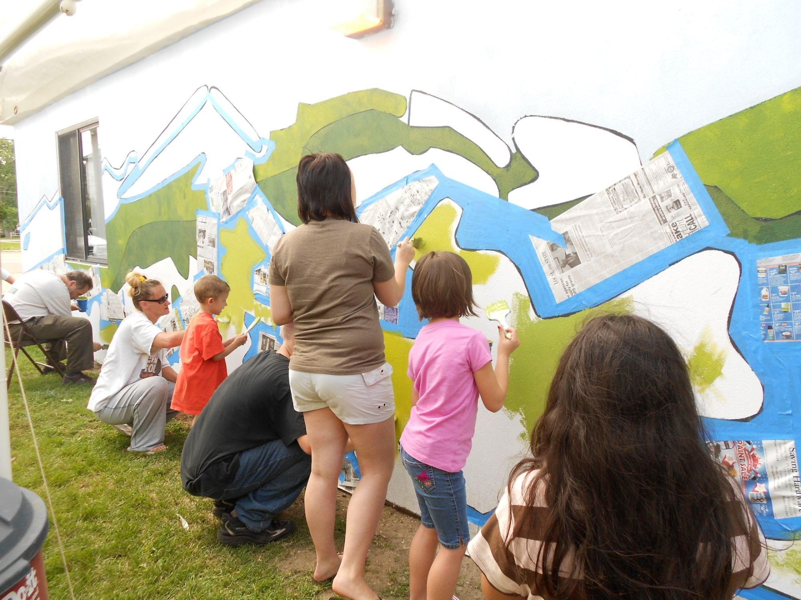
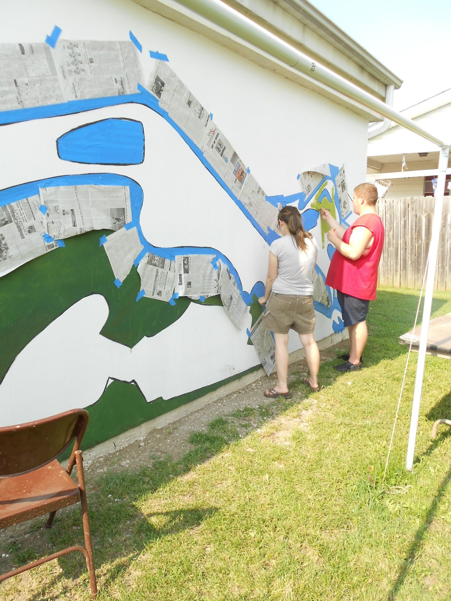
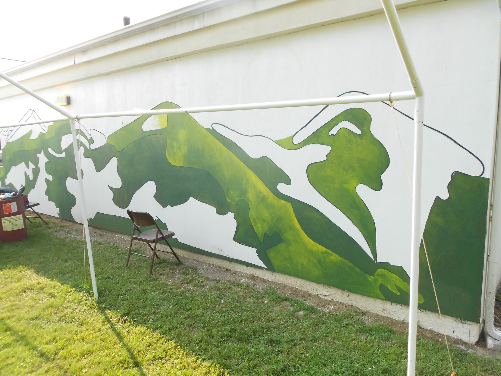

Commissioned by Athens County Public Libraries and the Chauncey Public Library. Layered green hills run the length of the building's side wall and turn the corner, an orange sun sitting low above the ridgeline.

Volunteers of all ages helped paint it in.

