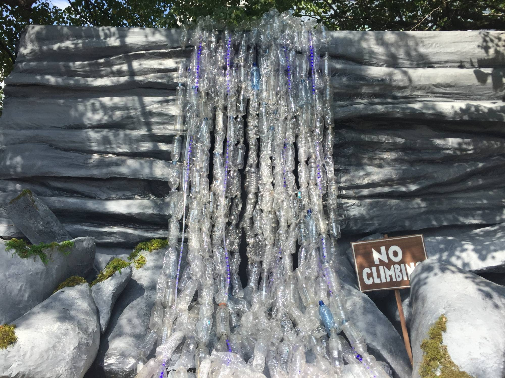
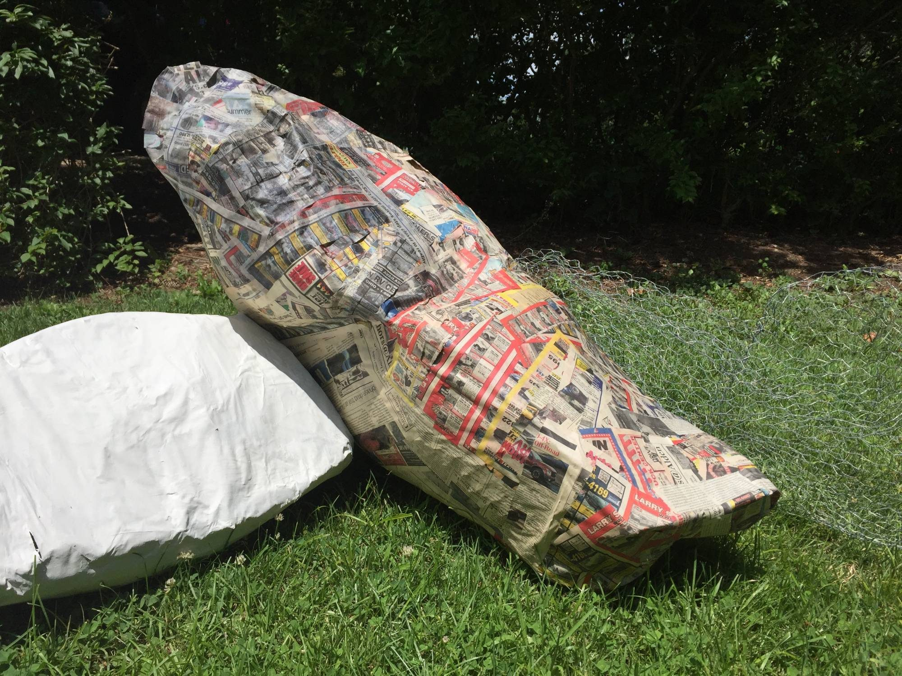
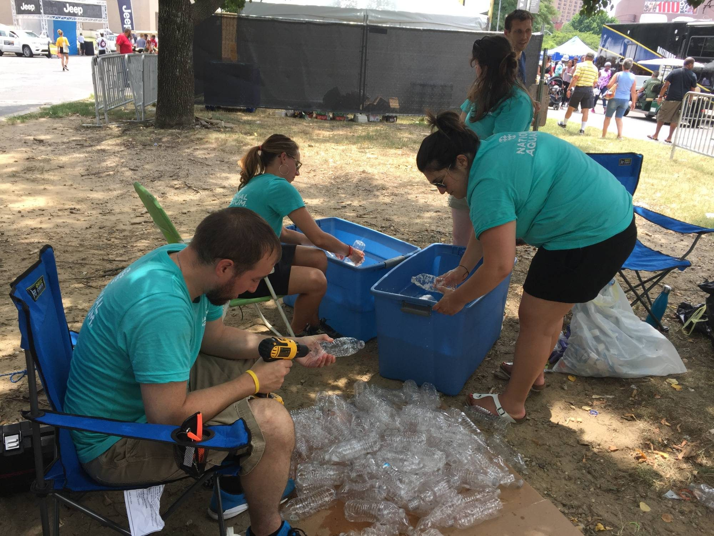
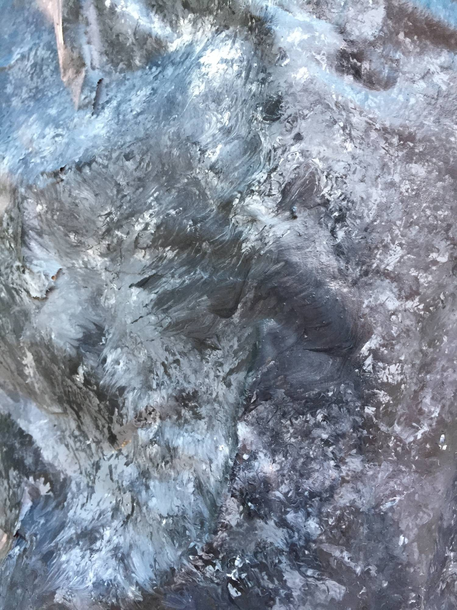

Inspired by the theme CAMP Artscape, we decided to create a nature scene similar to something you might see while camping: a trickling waterfall with stepping stones.

Repurposing single-use plastic items, of course, I sourced over 3,000 plastic water bottles. Our friends from Zero Waste and the Perry County Recycling Center donated all the bottles to help us create a 30' waterfall. Festival goers were encouraged to help us string up strands of water bottles.

All hands on deck with this installation, as much of the prep work for the bottles was done by our amazing volunteer team.

In addition to the waterfall and facade structure, we also painted a landscape mural of Swallow Falls, a waterfall located in central Maryland.

