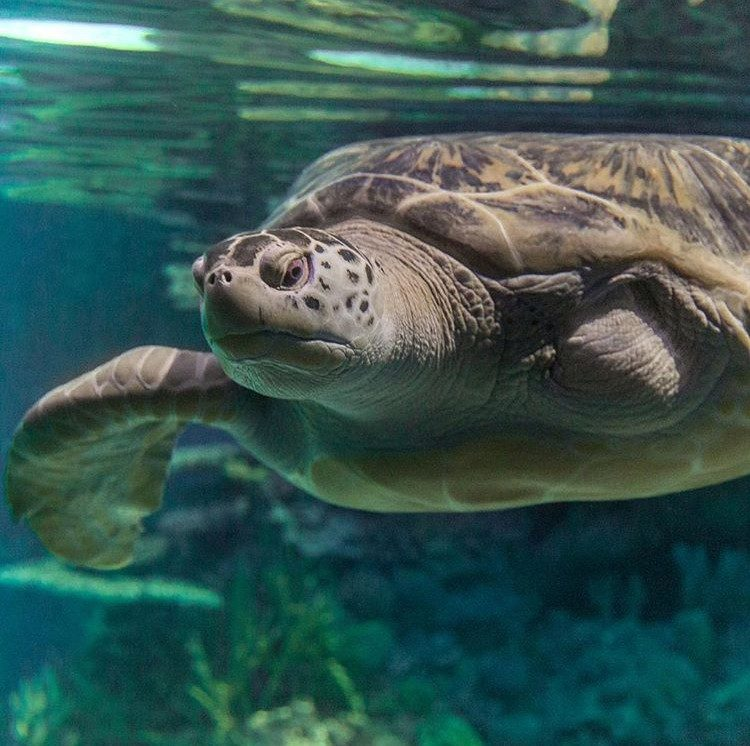
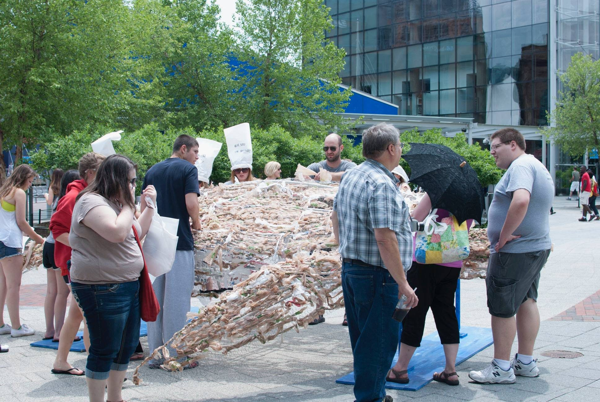
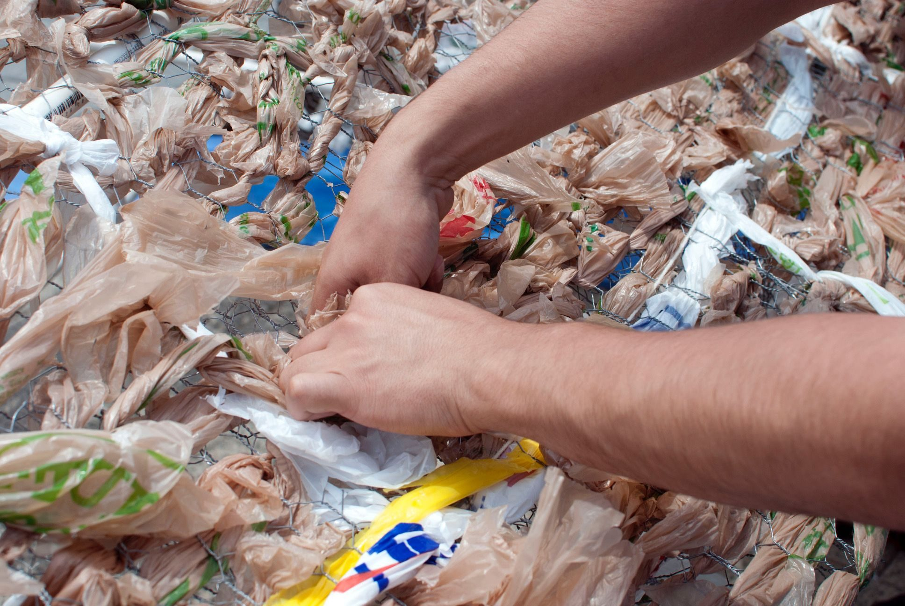
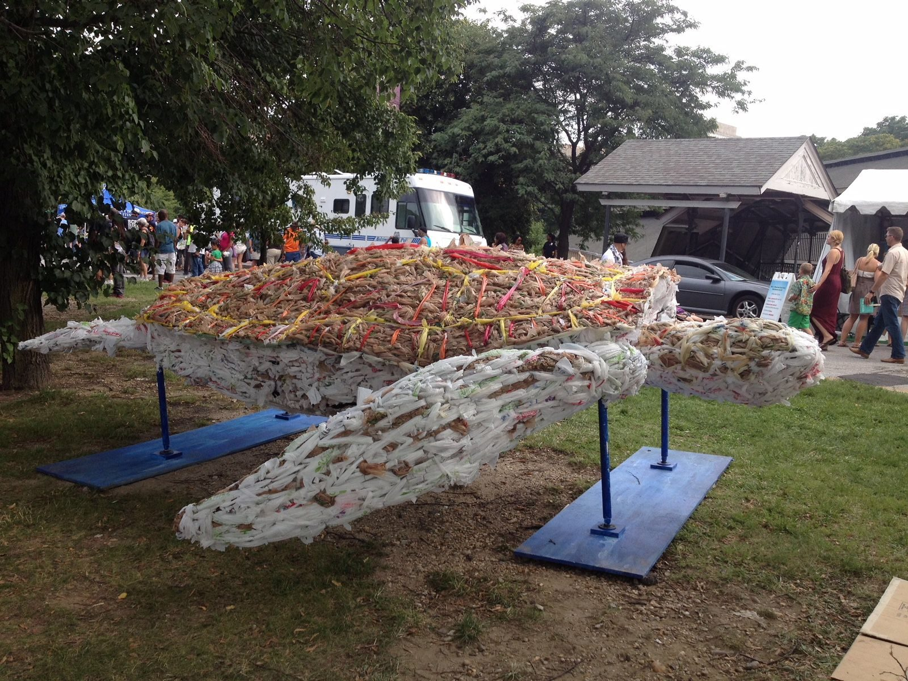

[National Aquarium](https://aqua.org/)

*Calypso* was my first project with the National Aquarium: a life-size sea turtle woven from single-use plastic bags over a chicken wire frame.

Passers-by at the Inner Harbor were invited to weave bags into the shell as the piece was built, and the turtle grew over the course of the day.

<iframe class="work-video" style="aspect-ratio: 16 / 9; height: auto; border: 0;" src="https://www.youtube.com/embed/wbinQpfAEnM" title="Kasey Jones on Calypso" allow="accelerometer; autoplay; clipboard-write; encrypted-media; gyroscope; picture-in-picture" allowfullscreen loading="lazy"></iframe>

*Talking about the project.*
