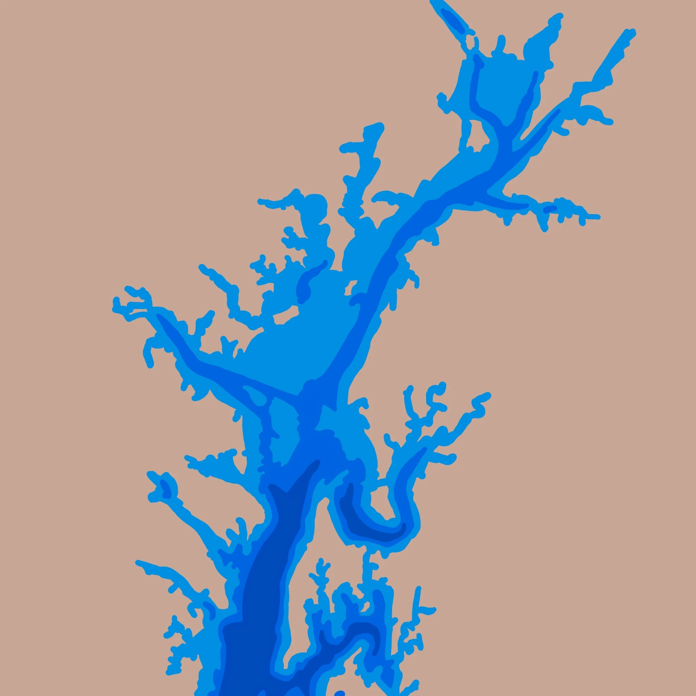
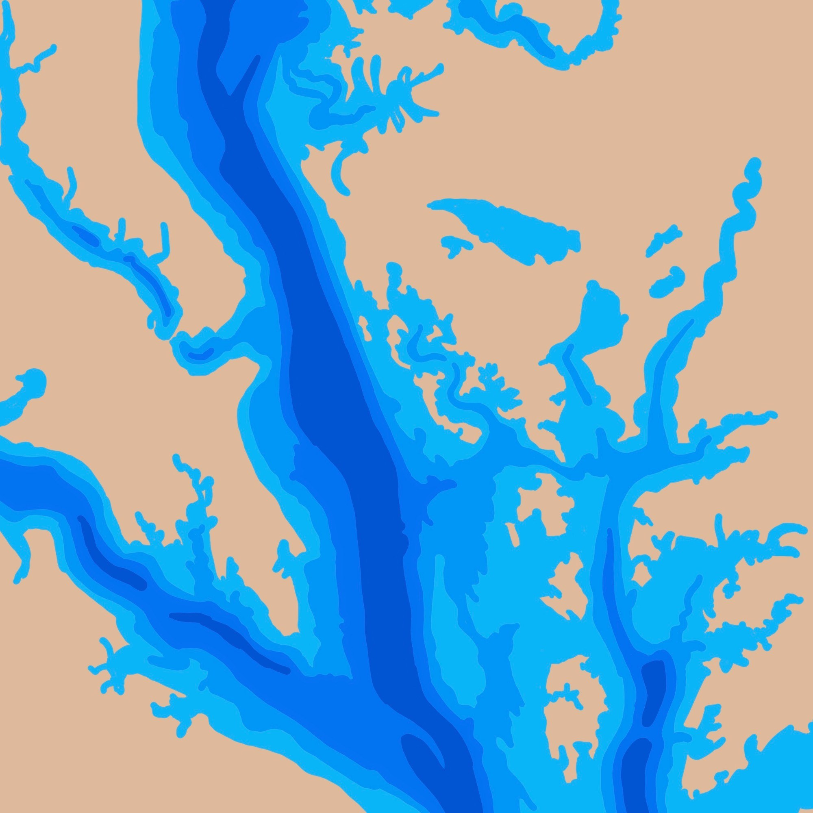

[National Aquarium](https://aqua.org/)

Painted for the National Aquarium alongside [A Ripple Effect](/work/a-ripple-effect/), this mural maps the Chesapeake Bay and the rivers that feed it.

It worked as a visual information map for visitors, showing the different watersheds and the areas of clean-up the aquarium has taken on to keep the waterways healthy, clean and free of waste.

