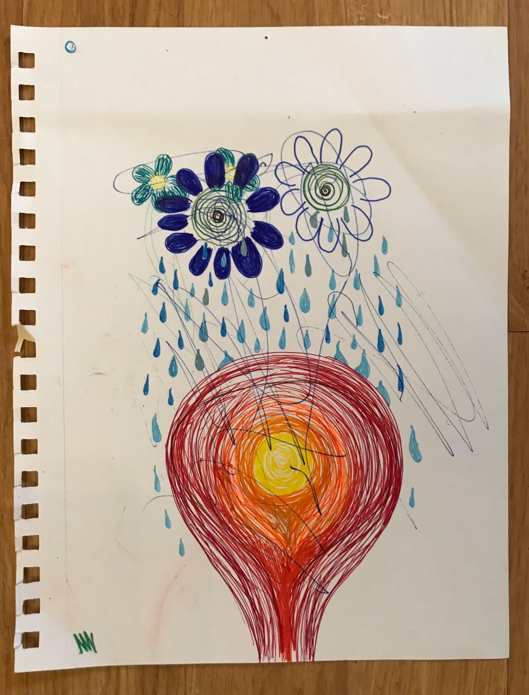
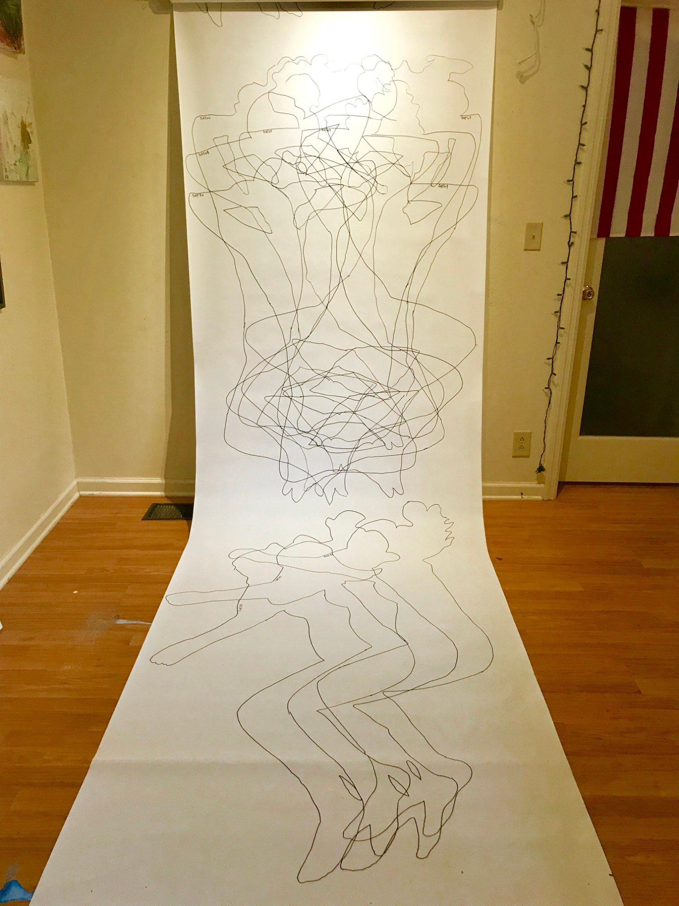
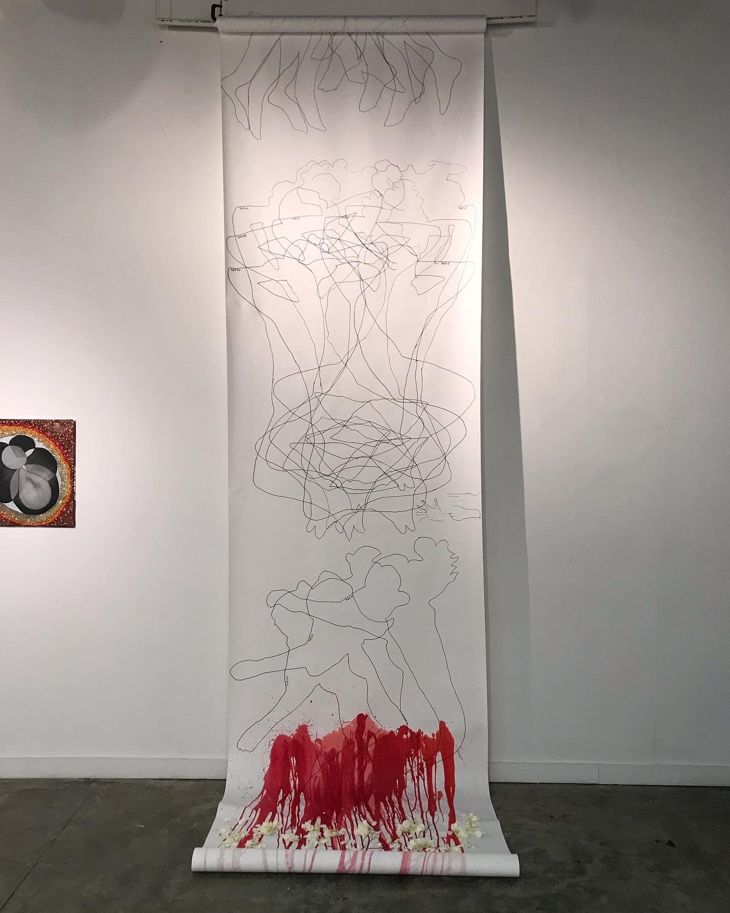
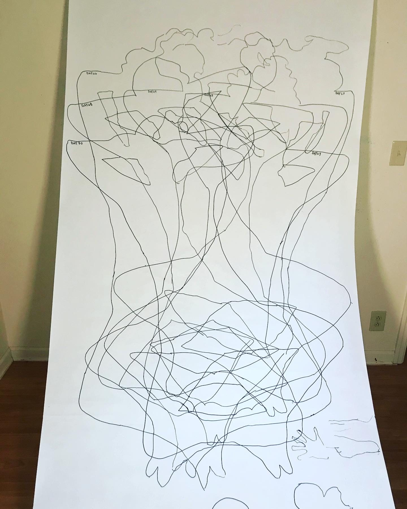
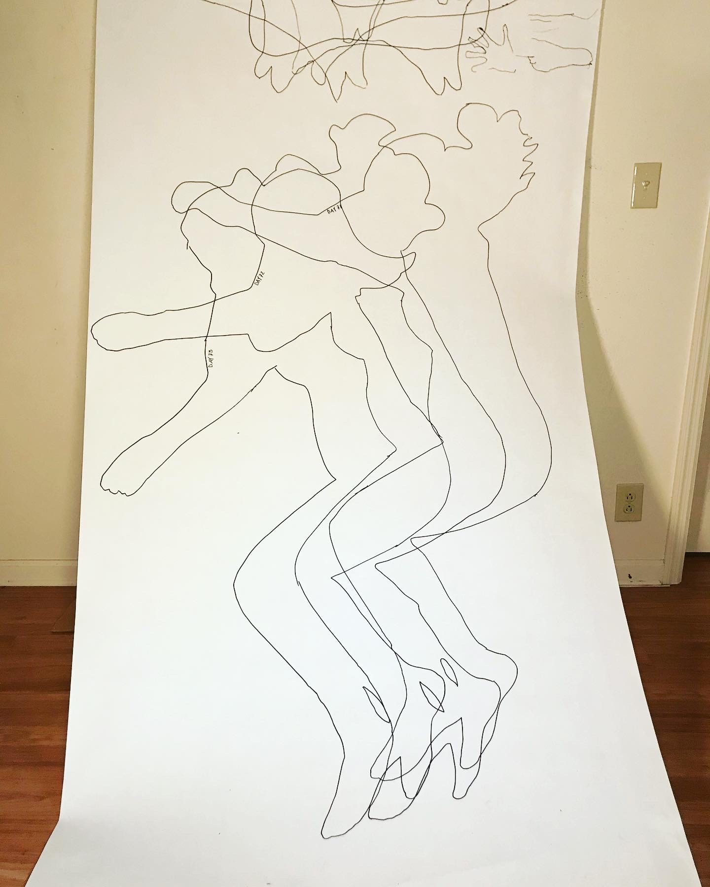
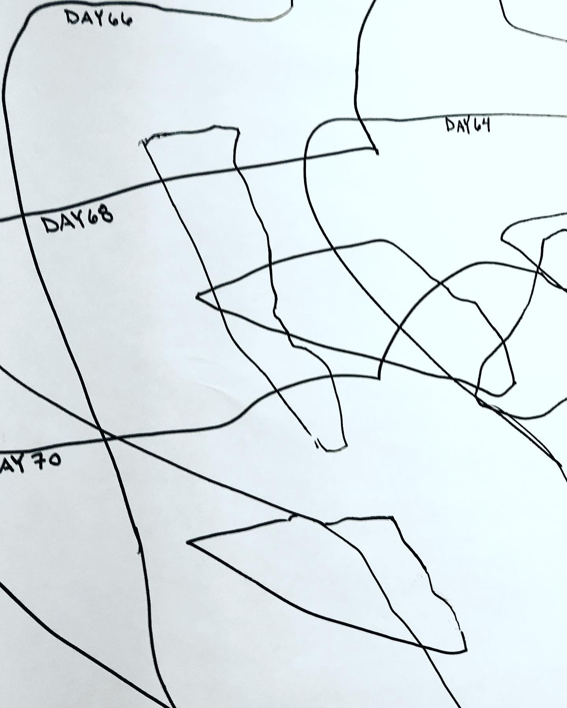
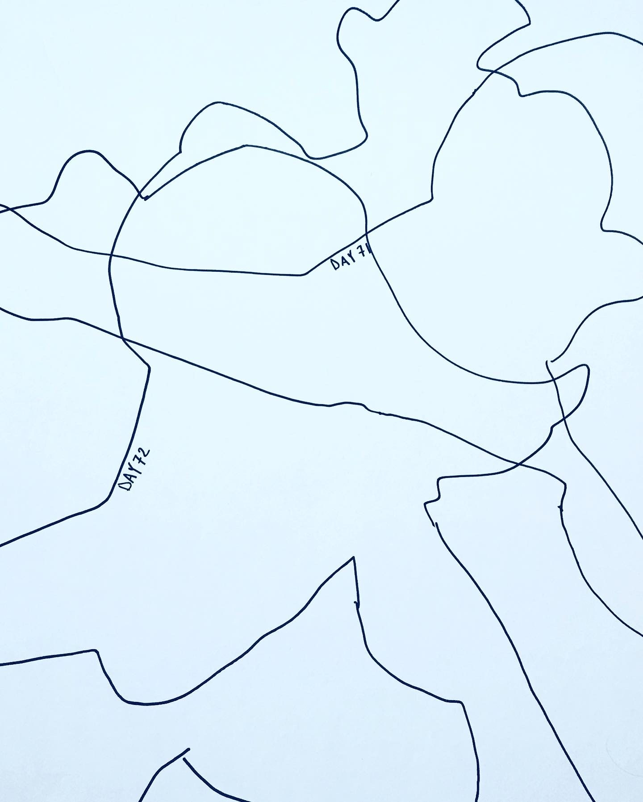
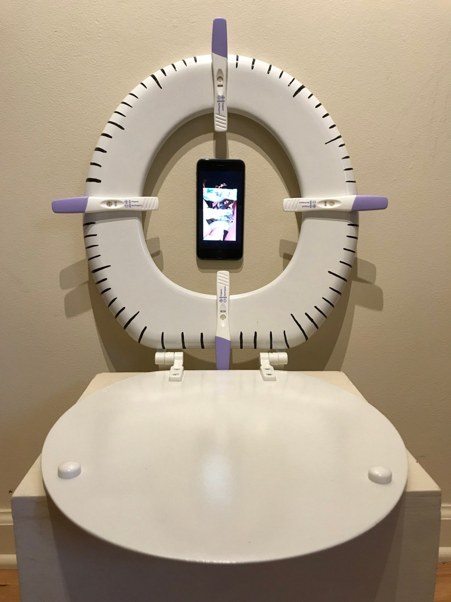
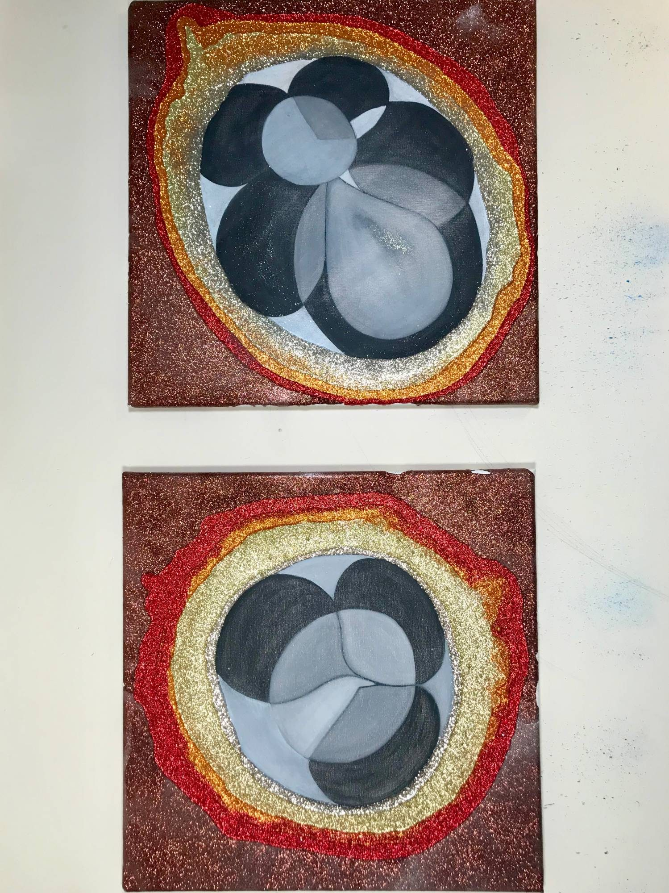
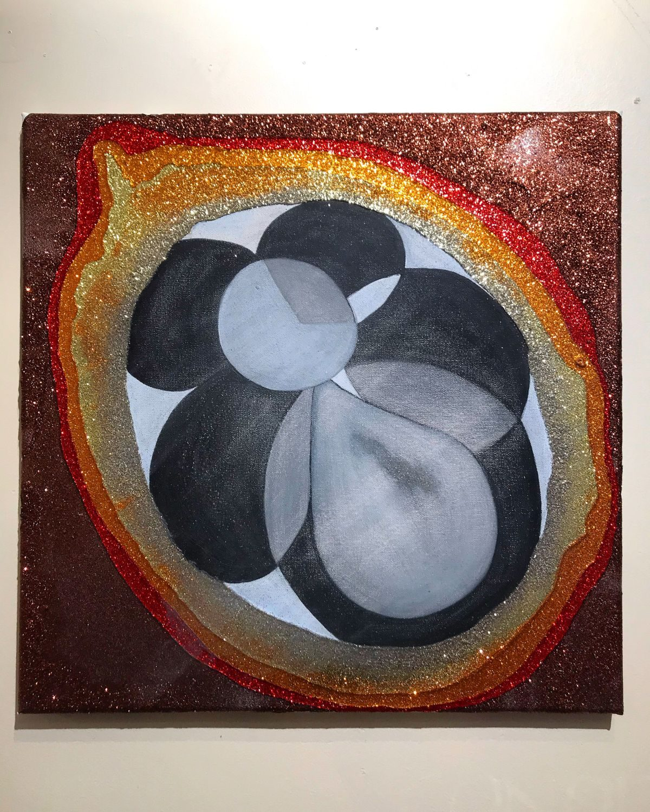

*Fuegito* — my little fire.

The bright red, orange and yellow symbolize the burn I felt during this pregnancy as my womb often felt on fire. It is because of this that this body of work is titled Fuego, or Fuegito — my little fire.

[Blood Thoughts](https://youtu.be/YLH662Miv2c) — a composition I wrote and filmed during this body of work.

*The Christmas My Baby Died, 2020 — oil and yarn on canvas, human legs, photography*

The light bulb shape represents my womb. I chose this shape because it is often used in relationship with having an idea. In regards to this piece, it represents the false ideas I had when I began my third pregnancy journey; that I will have this baby and that nothing could go wrong.

*Study.*

I had intended to outline my body every day for the entire duration of the pregnancy, not knowing that the pregnancy would end in miscarriage. That is why the piece ends with the blood, the loss, and the flowers, which represent grief.

*Week by Week*

<video class="work-video" controls preload="metadata" playsinline>
  <source src="/fuegito-drawings.mp4" type="video/mp4" />
  Your browser cannot play this video.
</video>

*The drawings on the roll.*

<video class="work-video" controls preload="metadata" playsinline>
  <source src="/fuegito-scroll.mp4" type="video/mp4" />
  Your browser cannot play this video.
</video>

*The scroll installed, the red running down into the flowers at its foot.*

*The Veil, 2020 — toilet seat, pregnancy tests, paint, iPhone and video*

The video depicts my incessant checking to see if I am pregnant.

The intent of this piece is to capture the time and intimate space between knowing and not knowing if you have conceived a child. In an attempt to share the anxiety of the unknown, these often private moments exist between a woman and her potentially fertilized ovum. Signifying the start of her journey as a vessel, *The Veil* represents this fragile, often unaccounted for time frame when a woman's body is open and begins the process of pulling energy from the Universe.

This piece is the first in the Fuego series, as this pregnancy resulted in a miscarriage at 16 weeks.

*Fuego: A Lesson in Control, 2020 — oil, graphite, charcoal and glitter on canvas*

I carried our baby for 16 weeks; 112 days. These two paintings represent the cell division of an embryo. Defects of chromosomal anomalies can happen within the first days or weeks of gestation.

In each of these paintings I applied 112 layers to represent every day that my body nurtured this baby. I then sanded, 112 times, off the surface of each painting. This methodical approach is a symbolic reference to the build up of hormones that I felt in my body. The sanding away of layers represents the residual hormones that lingered in my body for weeks after the loss.

Pregnancy loss is loss. It is physical and deeply emotional, and is only fully experienced at the expense and surrender of a woman's body.

<video class="work-video" controls preload="metadata" playsinline>
  <source src="/fuego-detail.mp4" type="video/mp4" />
  Your browser cannot play this video.
</video>

*Close on the glitter surface.*
