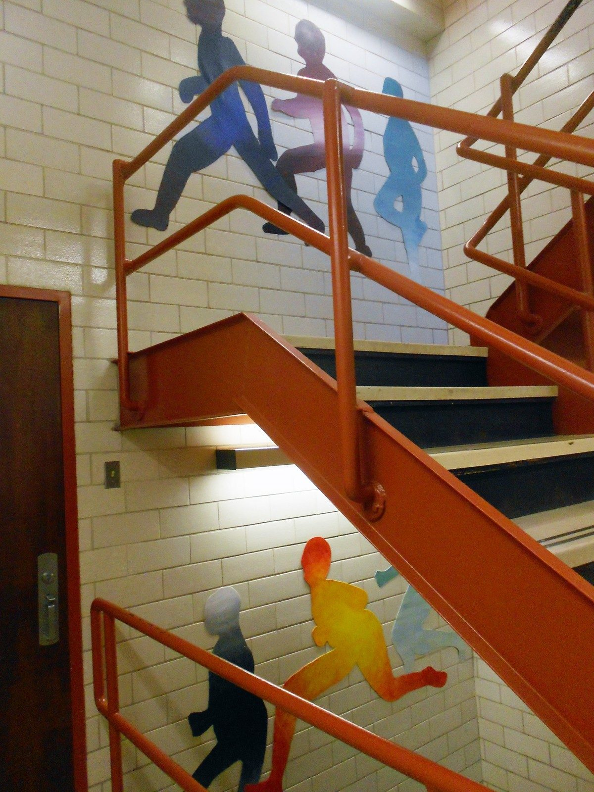
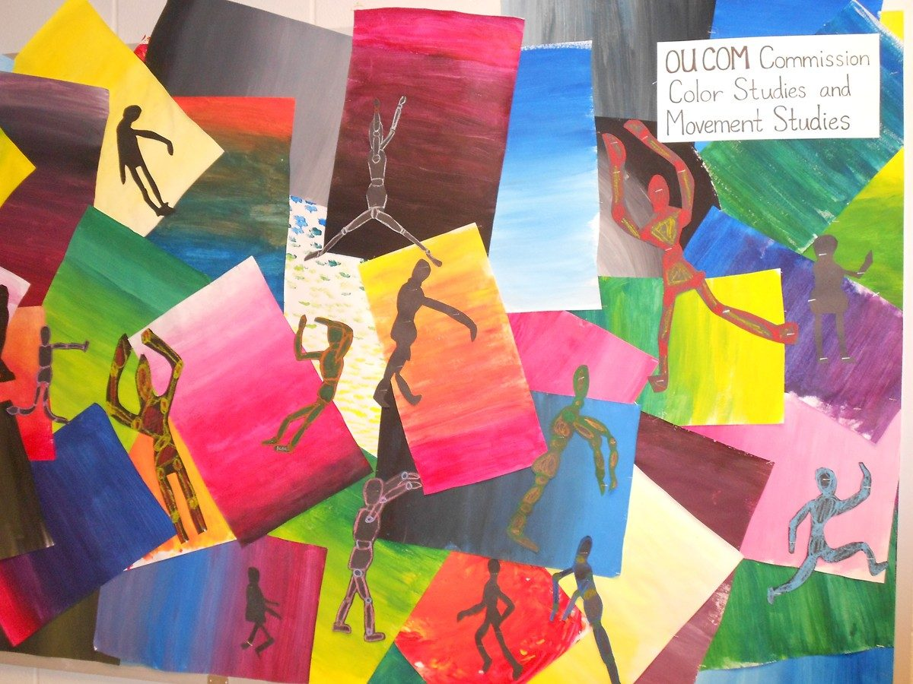
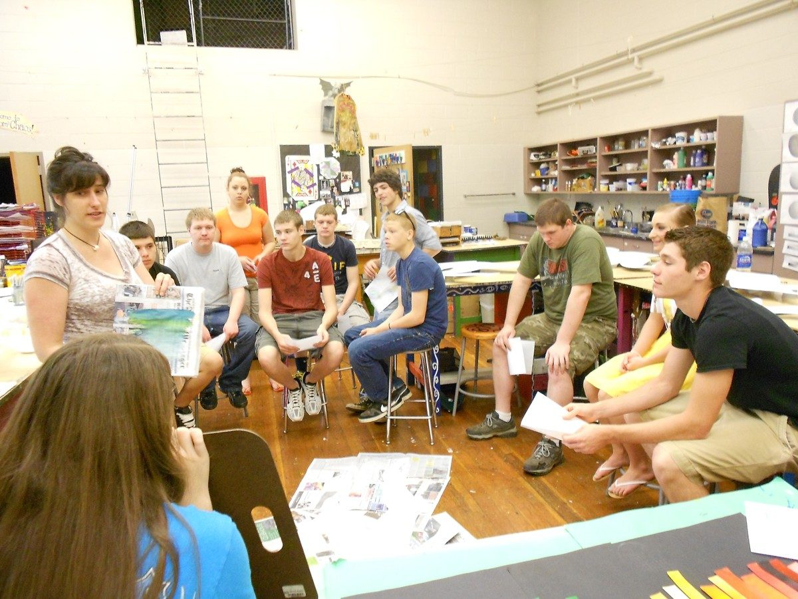
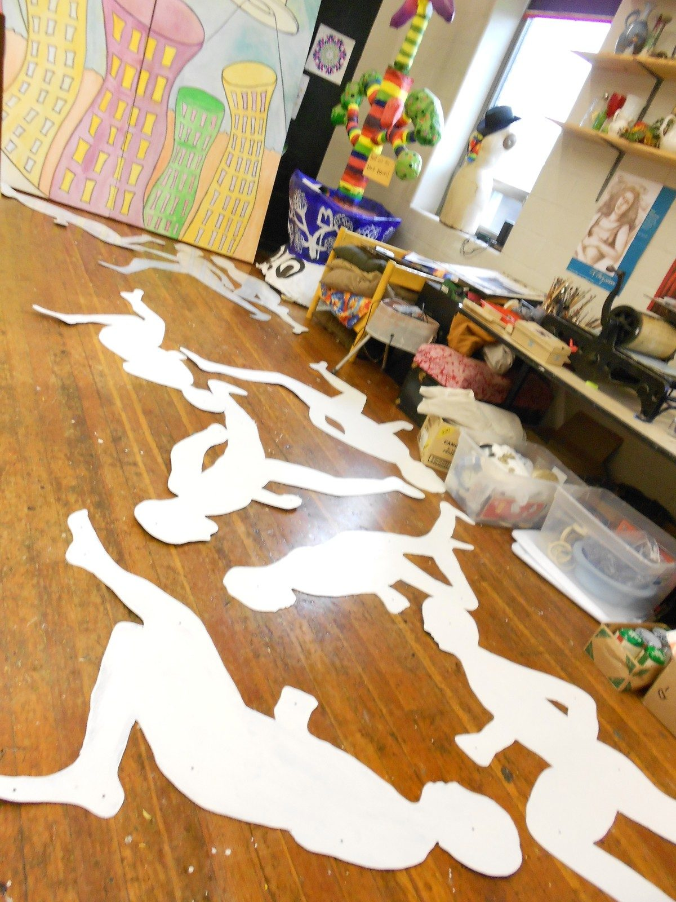
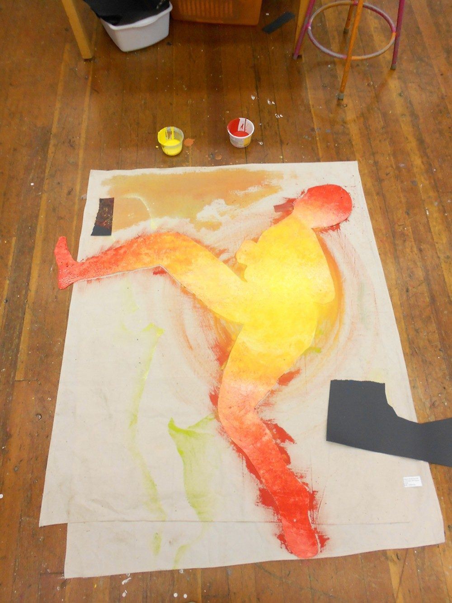

*Get Moving* is a laser-cut sheet metal installation in the stairwells of the Ohio University College of Osteopathic Medicine, made to encourage people to take the stairs. Figures run up the wall alongside the steps, shifting from dark reds and blues into yellow and green as they climb.

The color and movement studies for the commission, worked out on paper first.

