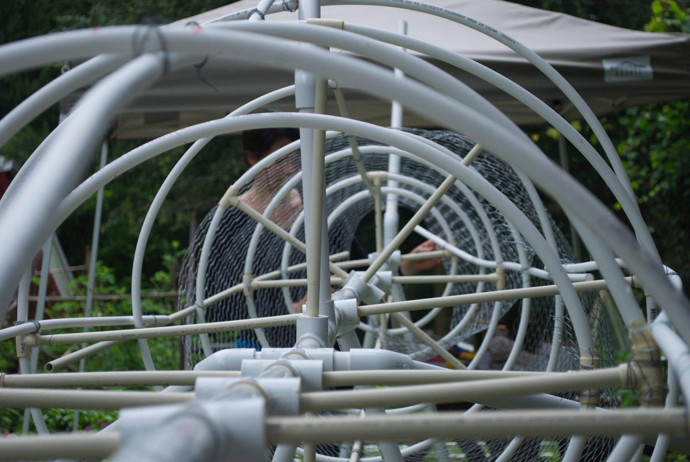
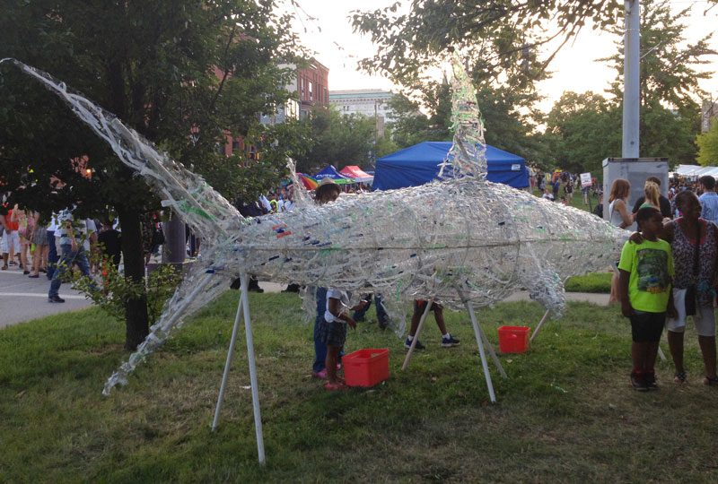
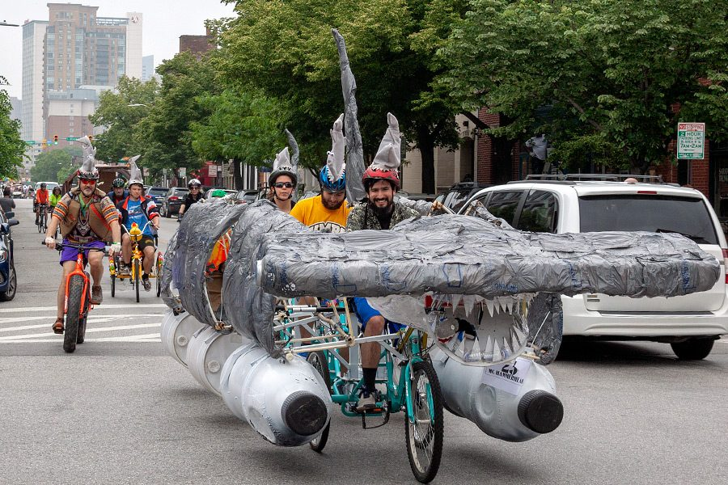
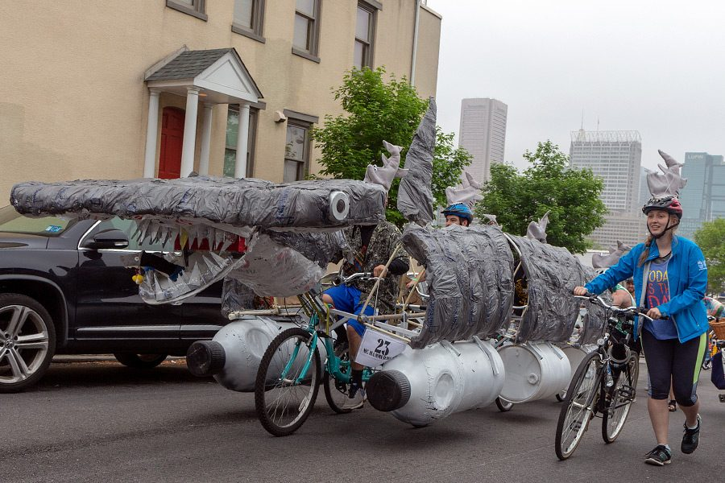
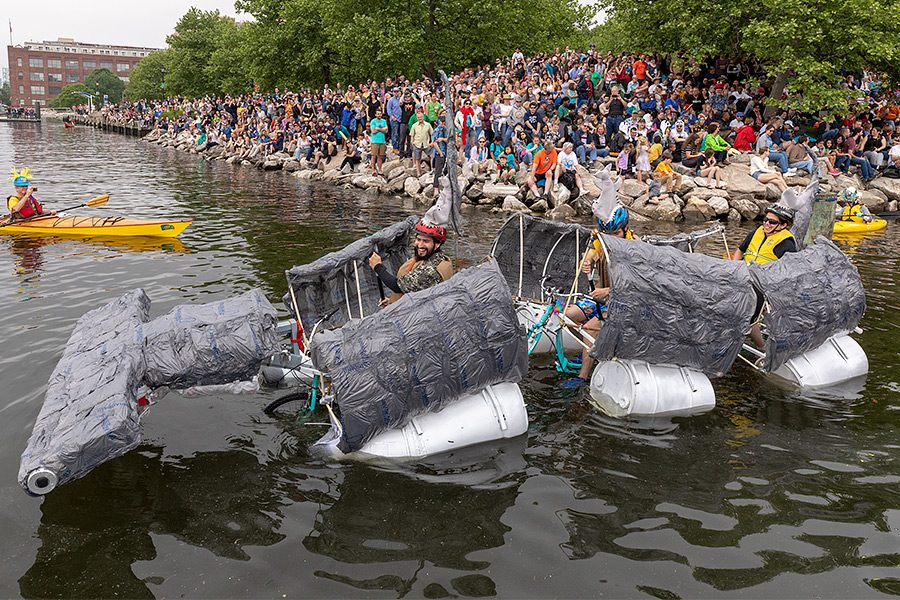
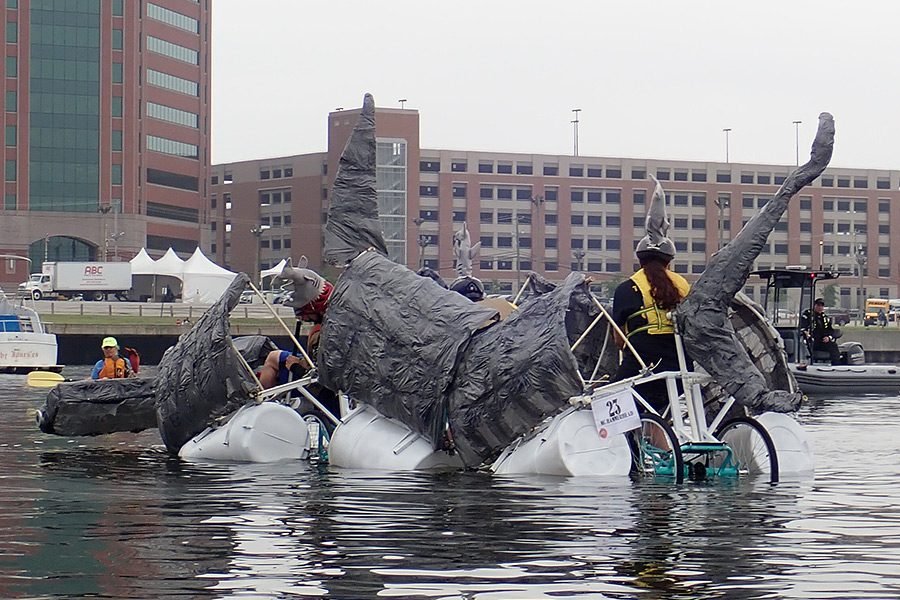
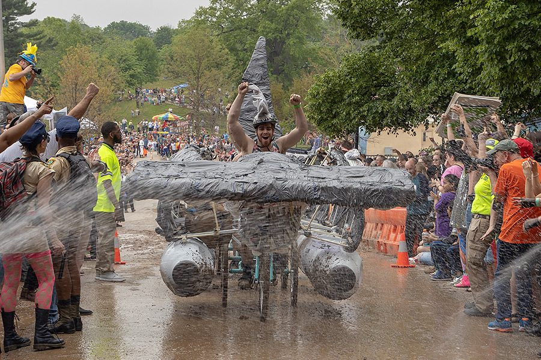

[National Aquarium](https://aqua.org/)

Commissioned by the National Aquarium, I created a 16-foot hammerhead shark for Baltimore's free art festival, Artscape.

This participatory sculpture invited Artscape attendees to help create the piece. They used strips of recycled plastic water bottles and wove them through the form of the shark.

The project was intended to raise awareness about how our plastic waste is affecting animals at the top of the food chain.

The shark was later transformed into a kinetic sculpture for the Kinetic Sculpture Race in Baltimore, hosted by the American Visionary Art Museum.

<iframe class="work-video" style="aspect-ratio: 16 / 9; height: auto; border: 0;" src="https://player.vimeo.com/video/134057390" title="Building the Hammerhead Shark" allow="autoplay; fullscreen; picture-in-picture" allowfullscreen loading="lazy"></iframe>

*Building the shark.*
