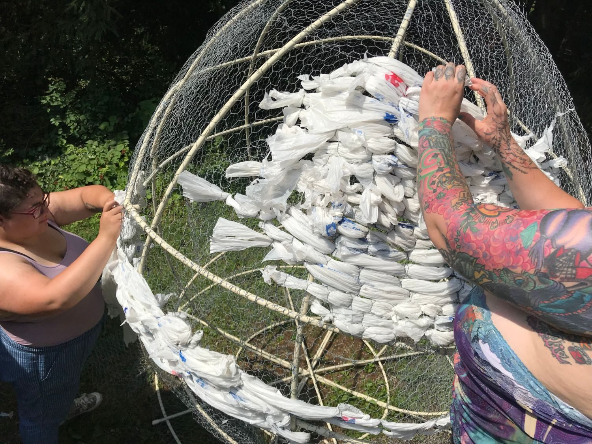
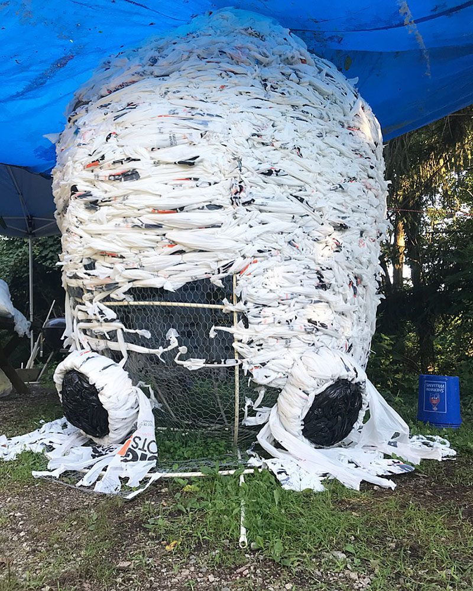
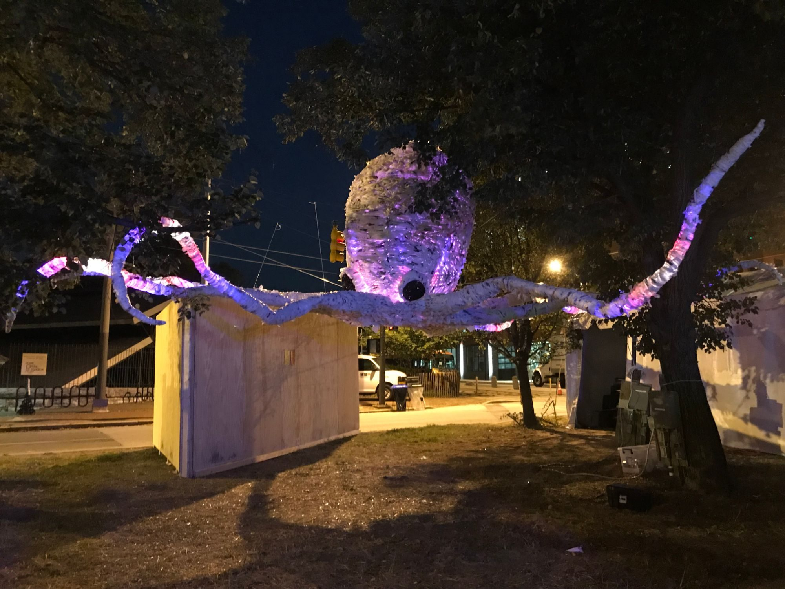
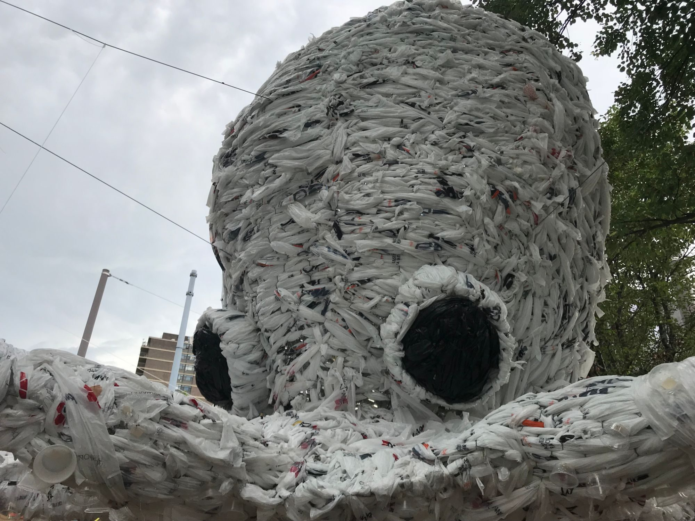
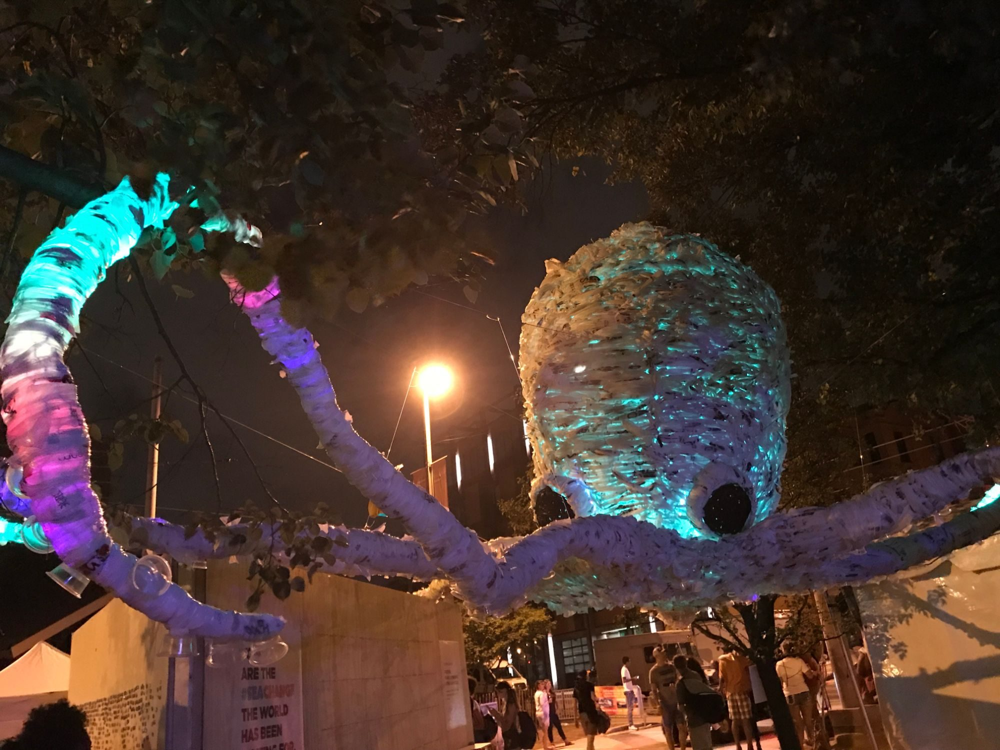
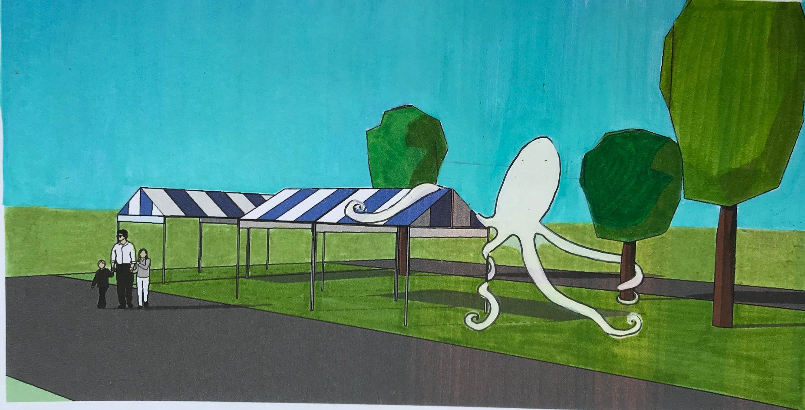

[National Aquarium](https://aqua.org/)

Commissioned by the National Aquarium for Artscape, *Octopus* is a 10 by 20 foot installation woven from single-use plastic bags over a frame of chicken wire and PVC pipe.

I made it to raise awareness about the effects of single-use plastics on our ecosystems, and on our waterways in particular. It was installed in tandem with Sea Change, a global campaign initiated by the aquarium. The scale of the sculpture was intended to draw people into the space so that we could begin the conversation. The installation also featured a VR experience.

