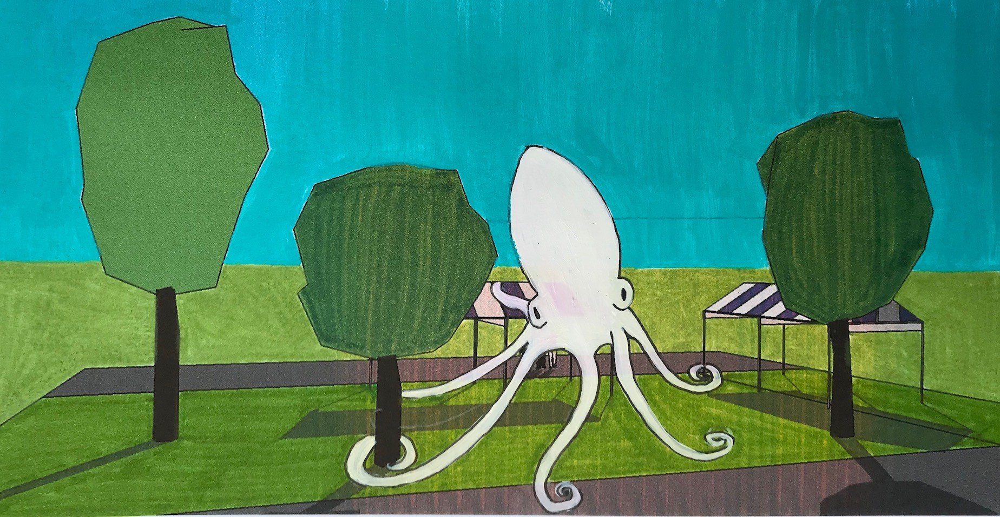
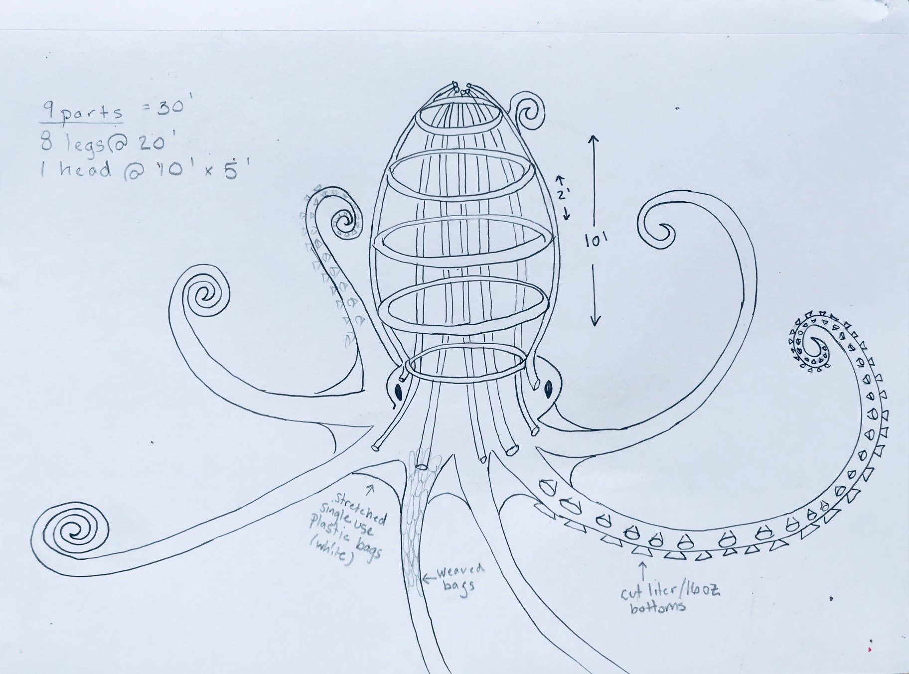

[National Aquarium](https://aqua.org/)

Commissioned by the National Aquarium for Artscape, *Octopus* is a 10 by 20 foot installation woven from single-use plastic bags over a frame of chicken wire and PVC pipe.

I made it to raise awareness about the effects of single-use plastics on our ecosystems, and on our waterways in particular. It was installed in tandem with Sea Change, a global campaign initiated by the aquarium. The scale of the sculpture was intended to draw people into the space so that we could begin the conversation. The installation also featured a VR experience.

Visitors didn't only look at it. A sign at the curb asked people to lend a hand to build an arm, and over the run of the festival the public helped weave all eight of them. Beside the sculpture, the aquarium set up a pledge wall — choose a conservation action, take a button, pin it up. Hopeful. Protector. Fearless. Curious. Bold. By the end of the weekend the buttons had filled in the words *Sea Change*. Sea change, see the change.

*Site mock-up*

*Site mock-up*

*Concept sketch and build plan*

