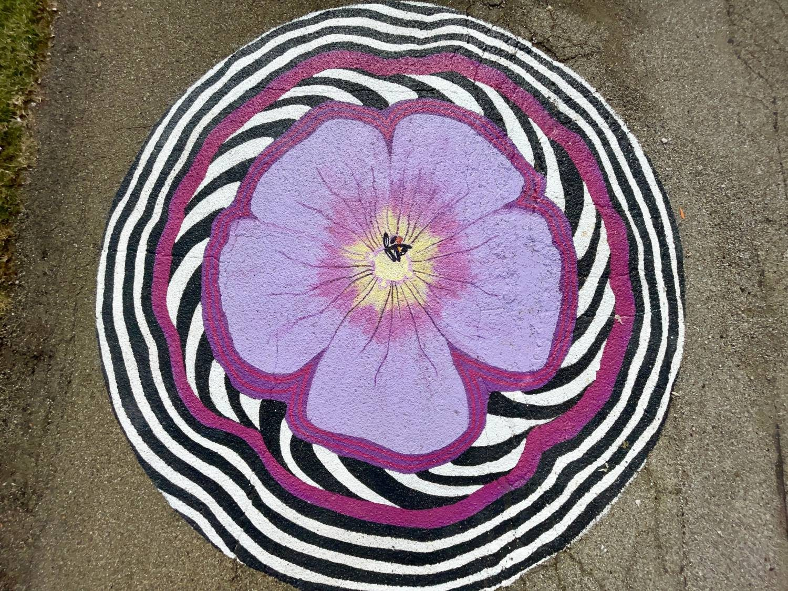
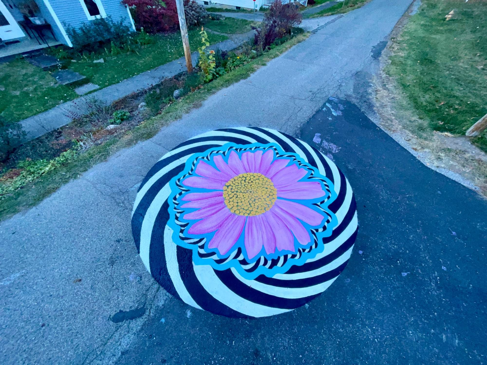
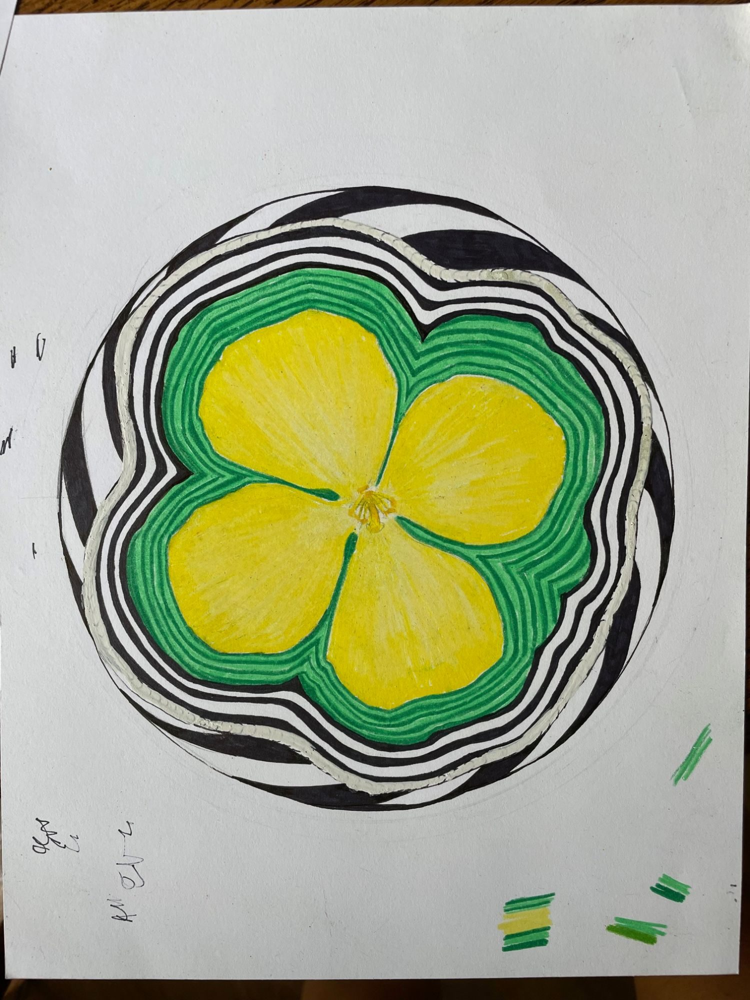

Commissioned by Creating Healthy Communities, a program of the Athens City-County Health Department, in collaboration with the Village of Amesville, this asphalt art installation spans the intersections of four village streets.

Asphalt art encourages drivers to slow down and stay alert for pedestrians and cyclists, the most vulnerable users of the road. It is also a placemaking strategy, a way for community members to create and revitalize their own public spaces.

I painted the four corners of the Amesville Elementary Running Club's route, so the murals mark a point of local pride while making the streets safer for the students who run them. Each one features Ohio native flowers: trillium, celandine poppy, purple coneflower, and geranium.

*Concept design for the celandine poppy corner.*
