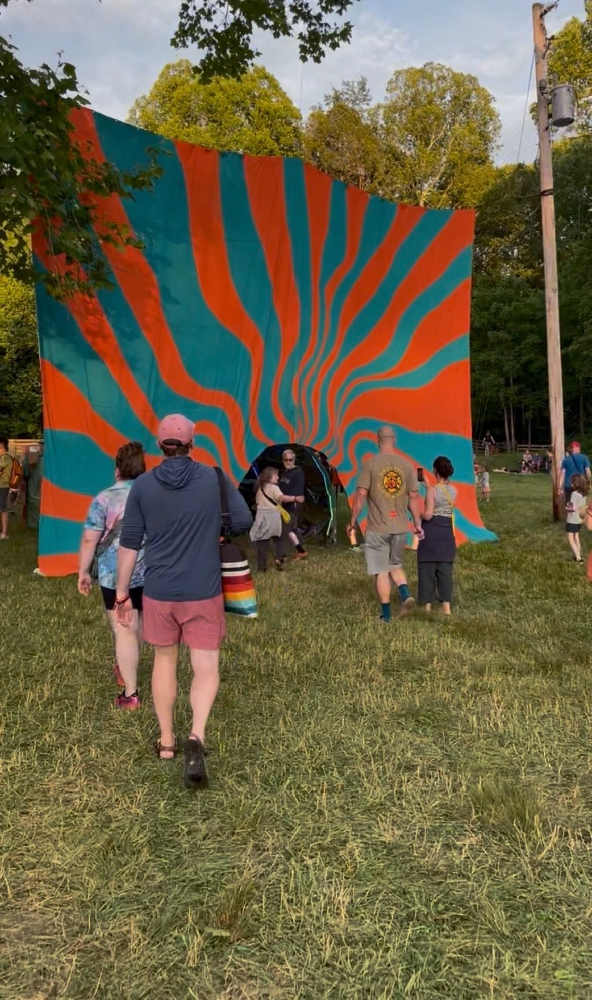
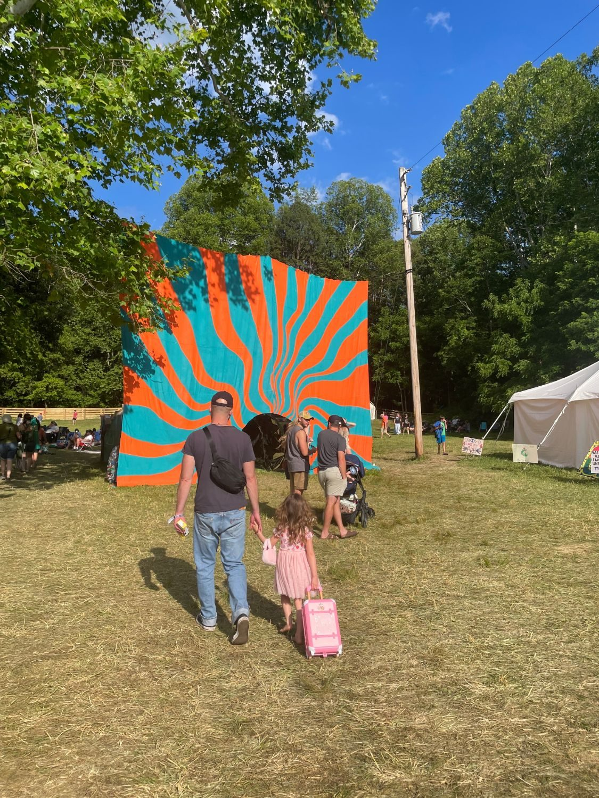

Commissioned by the Nelsonville Music Festival, *Portal to Porch Stage* is a large-scale installation built around a 30 by 40 foot backdrop and a walk-through tunnel measuring 10 by 20 feet.

The inside of the portal is lined with mirrored reflective paper and fitted with programmable LED lights. As people move through, a programmed light sequence runs across the reflective surfaces.

