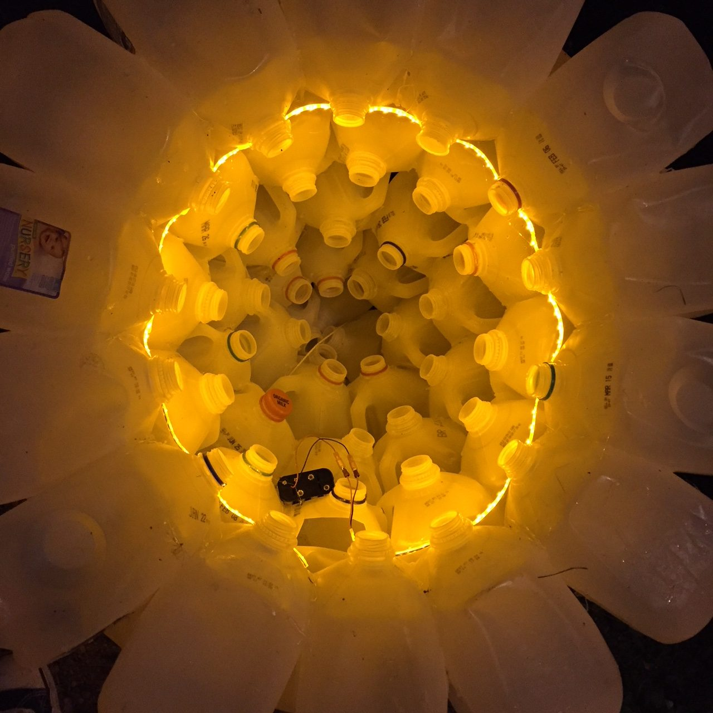
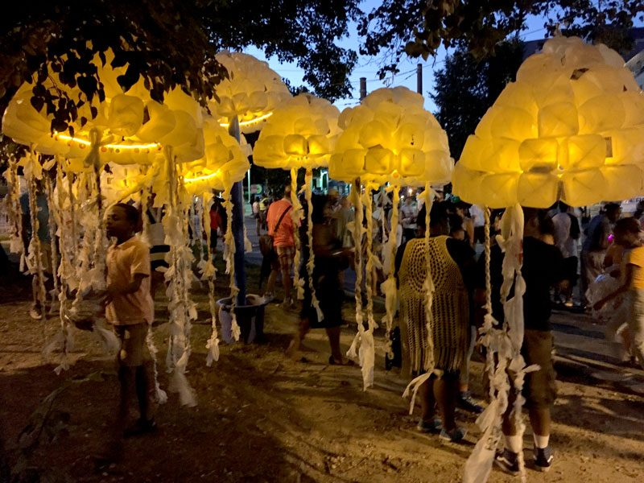
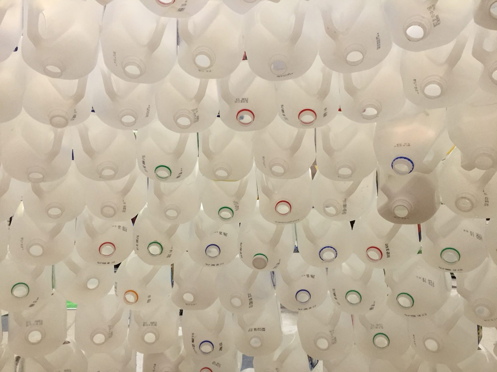
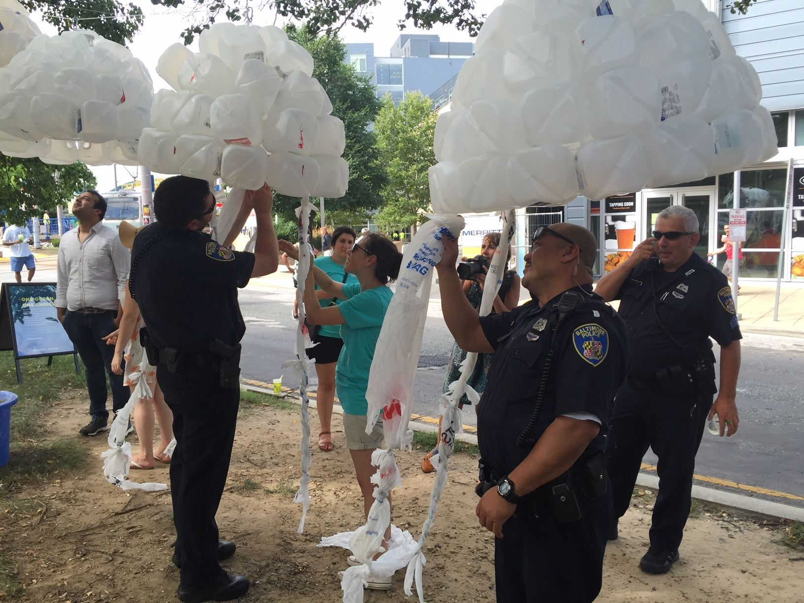

[National Aquarium](https://aqua.org/)

I was commissioned by the National Aquarium to create another participatory installation for Artscape 2016. Artscape is the largest free arts festival in the United States, located in Baltimore, Maryland.

The medium is always the message when working with the aquarium, and this year's theme was *Space: Explore what's out there*. I fabricated two installations for our space: a smack of jellies, as well as a mural.

The smack of jellies represented a new species of bioluminescent jellyfish that had recently been discovered in the Mediterranean Sea. The mural depicted the [transformation of a vampire squid](/work/transformation-of-a-vampire-squid/), a deep sea creature that lives where sunlight never penetrates.

With help from the Ohio Valley Discovery Museum, I was able to build twelve jelly bells, and from those bells participants were encouraged to add tentacles using recycled plastic bags. Festival goers also had the opportunity to help paint the 'paint by number' mural.

The installations drew in over 10,000 people, with more than 2,000 people participating in the creation of the work.
