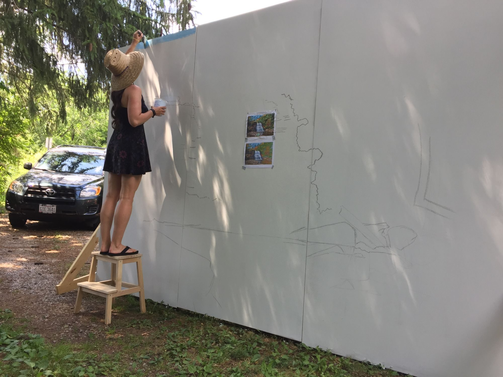
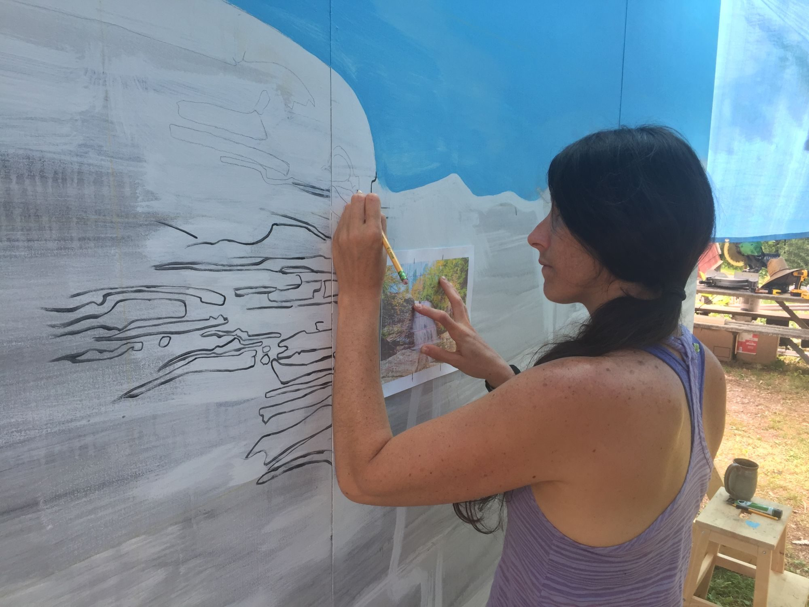
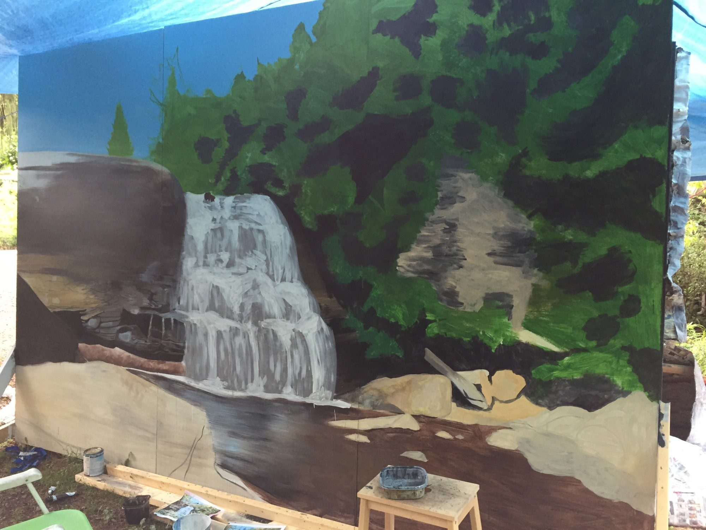
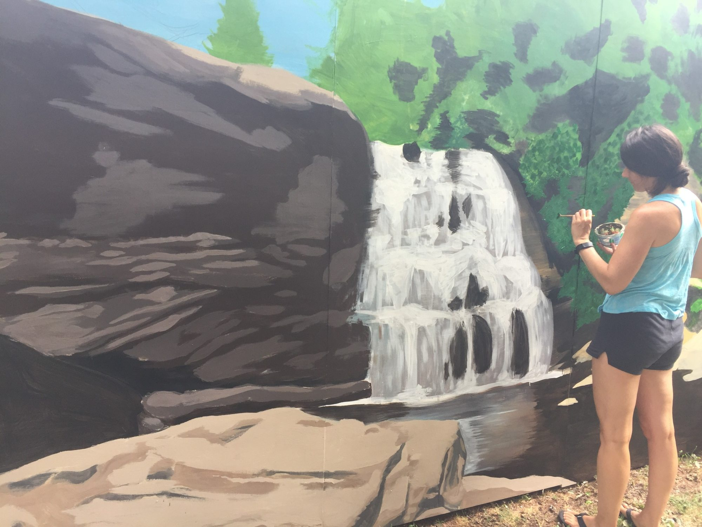
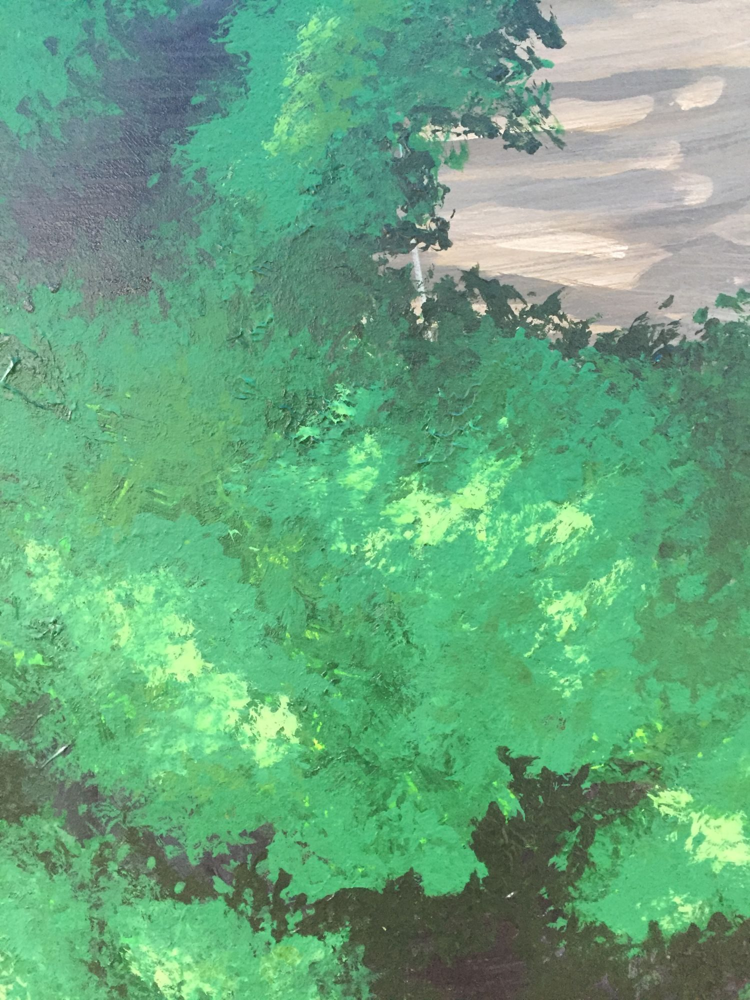

*Swallow Falls* is a painted mural made to accompany [*Aquarium Falls*](/work/aquarium-falls/), the forty foot waterfall built from single-use plastic water bottles that stood in front of it.

*Blocking in the sky, with photographs of the real Swallow Falls taped up for reference.*

