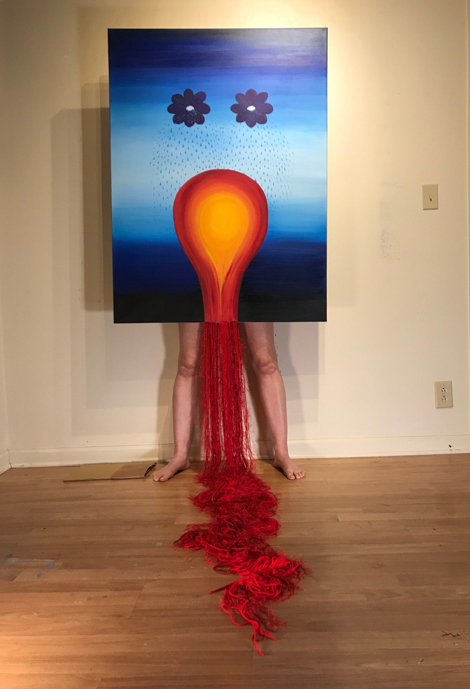

The light bulb shape represents my womb. I chose this shape because it is often used in relationship with having an idea. In regards to this piece, it represents the false ideas I had when I began my third pregnancy journey; that I will have this baby and that nothing could go wrong.

The bright red, orange and yellow symbolize the burn I felt during this pregnancy as my womb often felt on fire. It is because of this that this body of work is titled Fuego, or Fuegito — my little fire.

*Study.*
