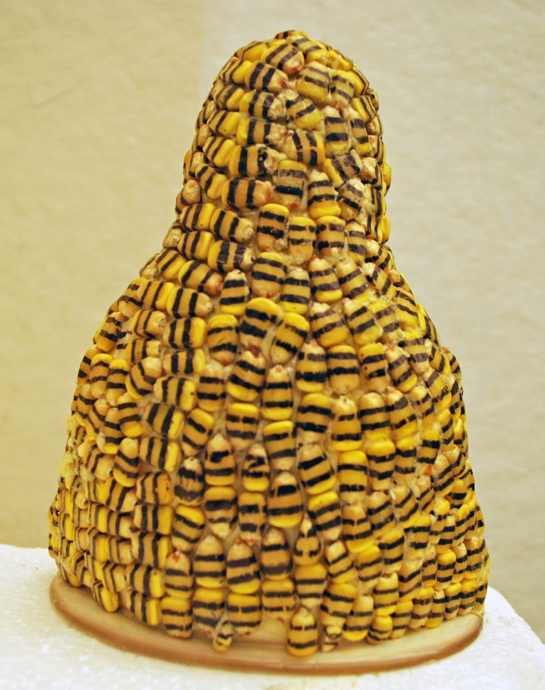
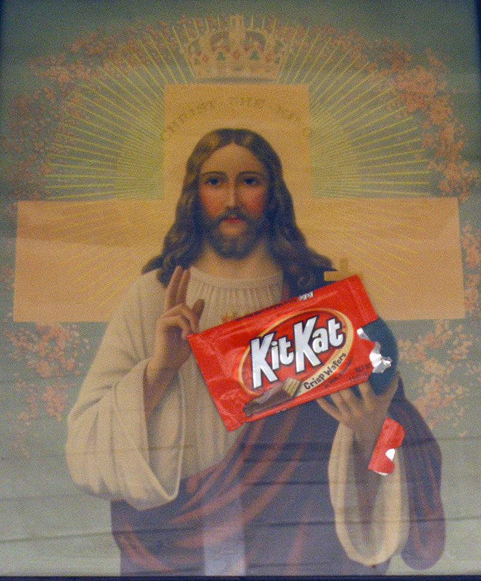
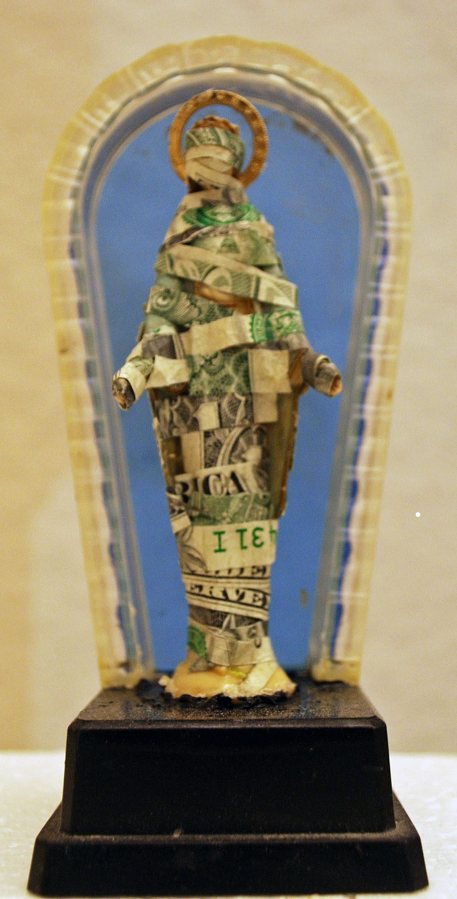

*The Power of Symbols* challenges the power symbols have on our psyche — specifically, the power of religious symbols. I power-clashed heavily loaded imagery with Christian imagery to make my viewers think about what we value as a society: perhaps how we value religion and money, a human construct, over the preservation of planet earth.

*Genetically Modified Mary*

*Kit-Kat Christ*

*What We Really Worship*
