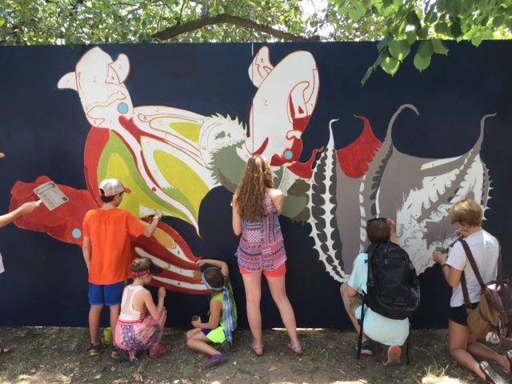
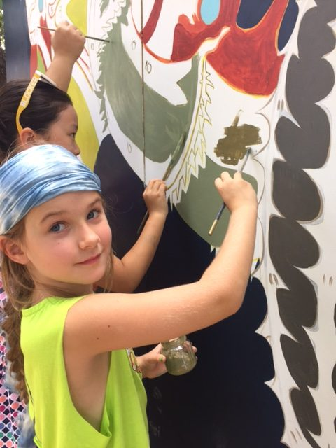
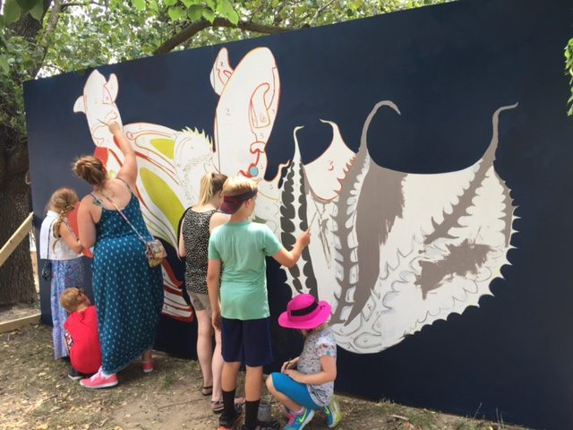
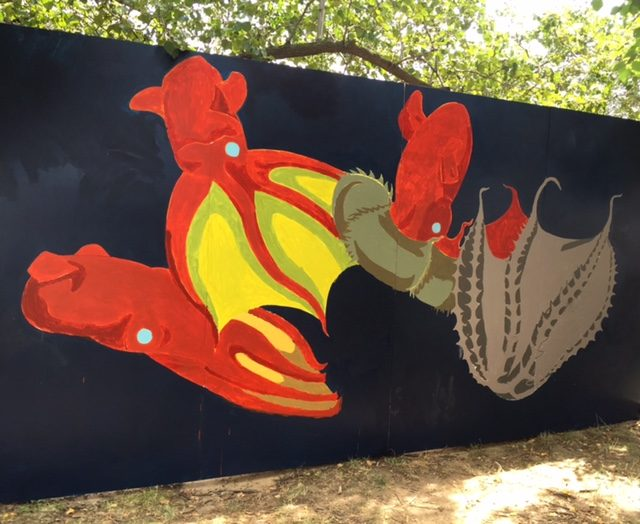

[National Aquarium](https://aqua.org/)

*Transformation of a Vampire Squid* is a painted mural following a vampire squid through three stages, from a deep red webbed form to a pale, inverted one, across a dark blue ground.

Festival goers painted it with me, filling in the shapes paint-by-number style over the course of the weekend.

