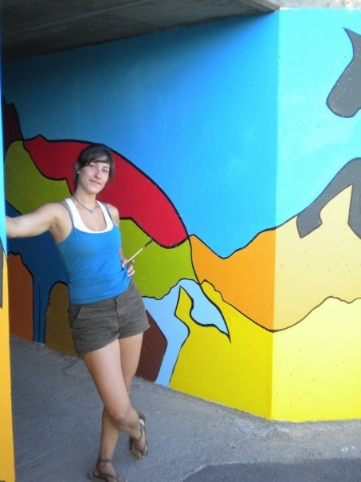
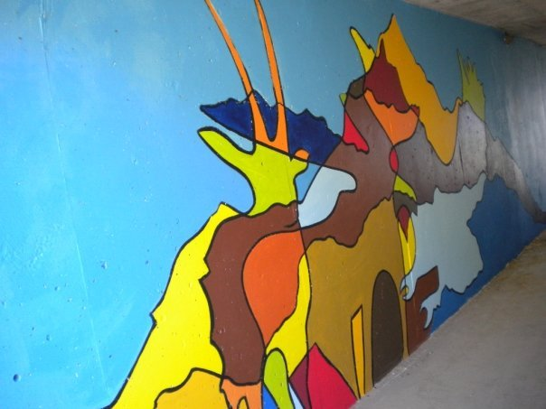
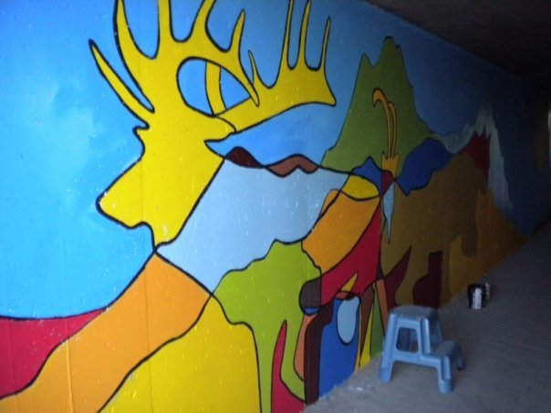
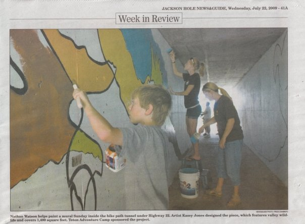

Commissioned by Friends of the Community Pathways and High Five Recreation Therapy, *Wild Wyoming* covers 1,800 square feet of a pedestrian underpass on the bike path that winds through Jackson Hole, Wyoming.

*Jackson Hole News & Guide, July 22, 2009*
