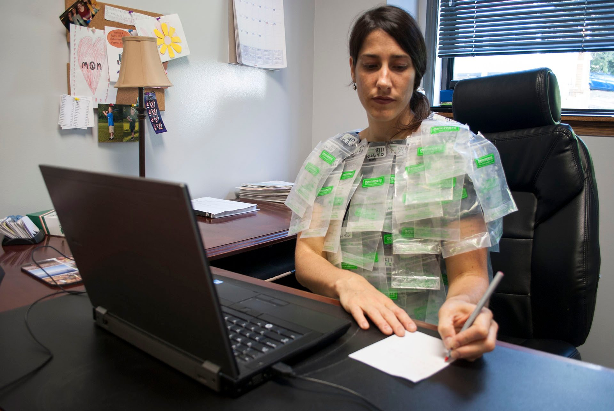
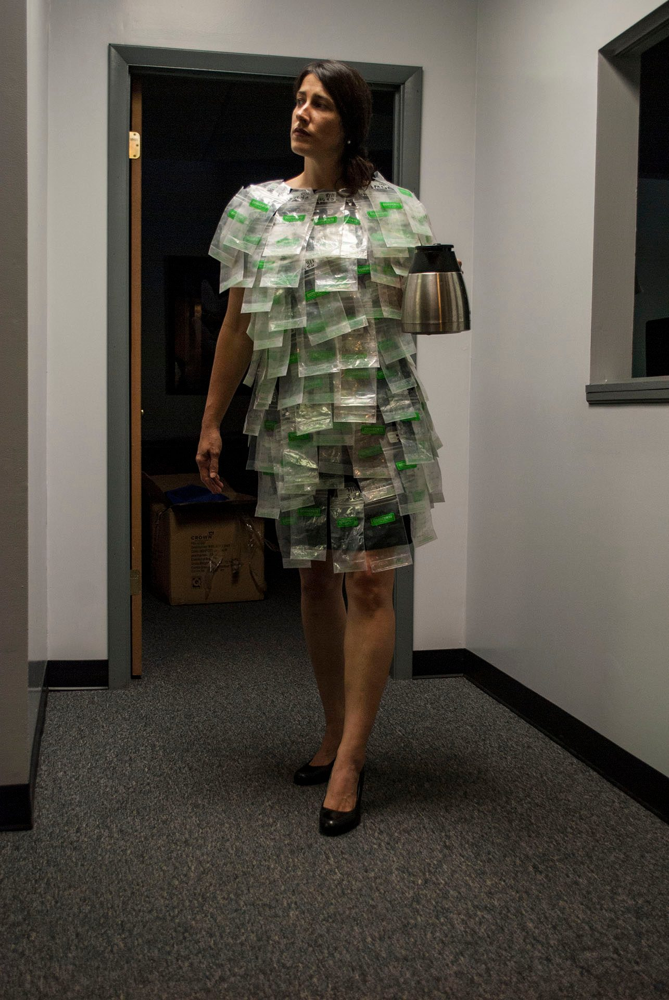
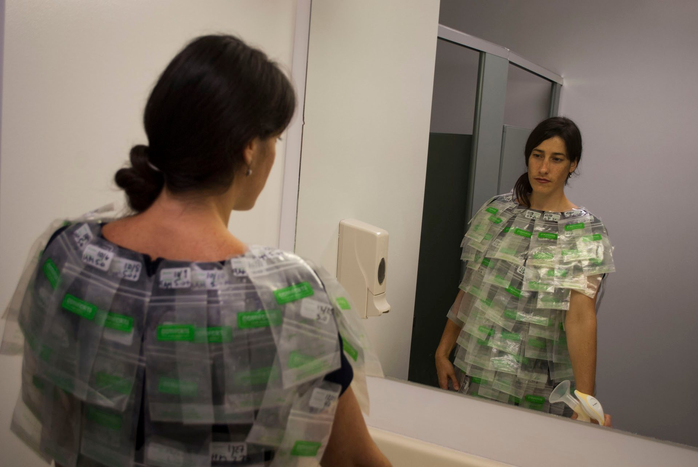
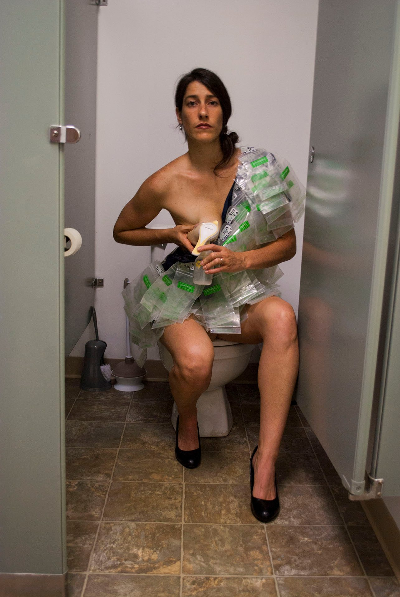
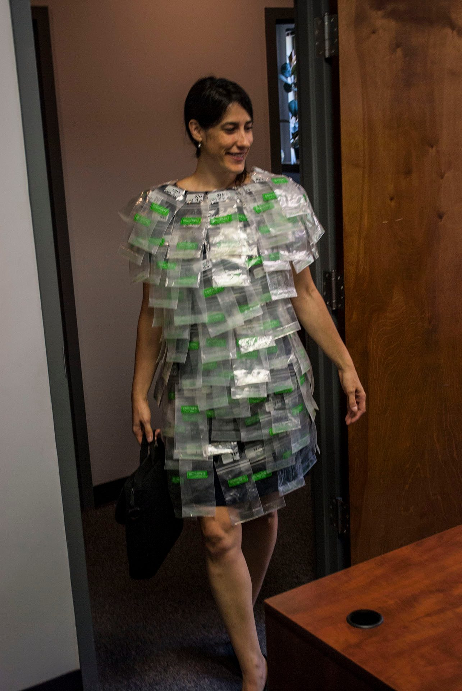
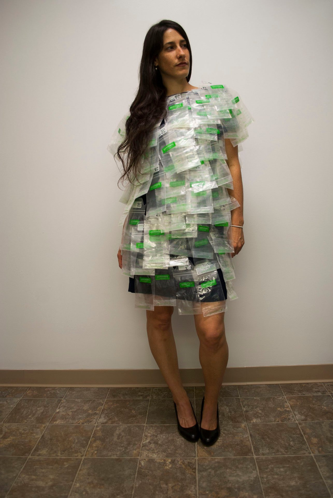
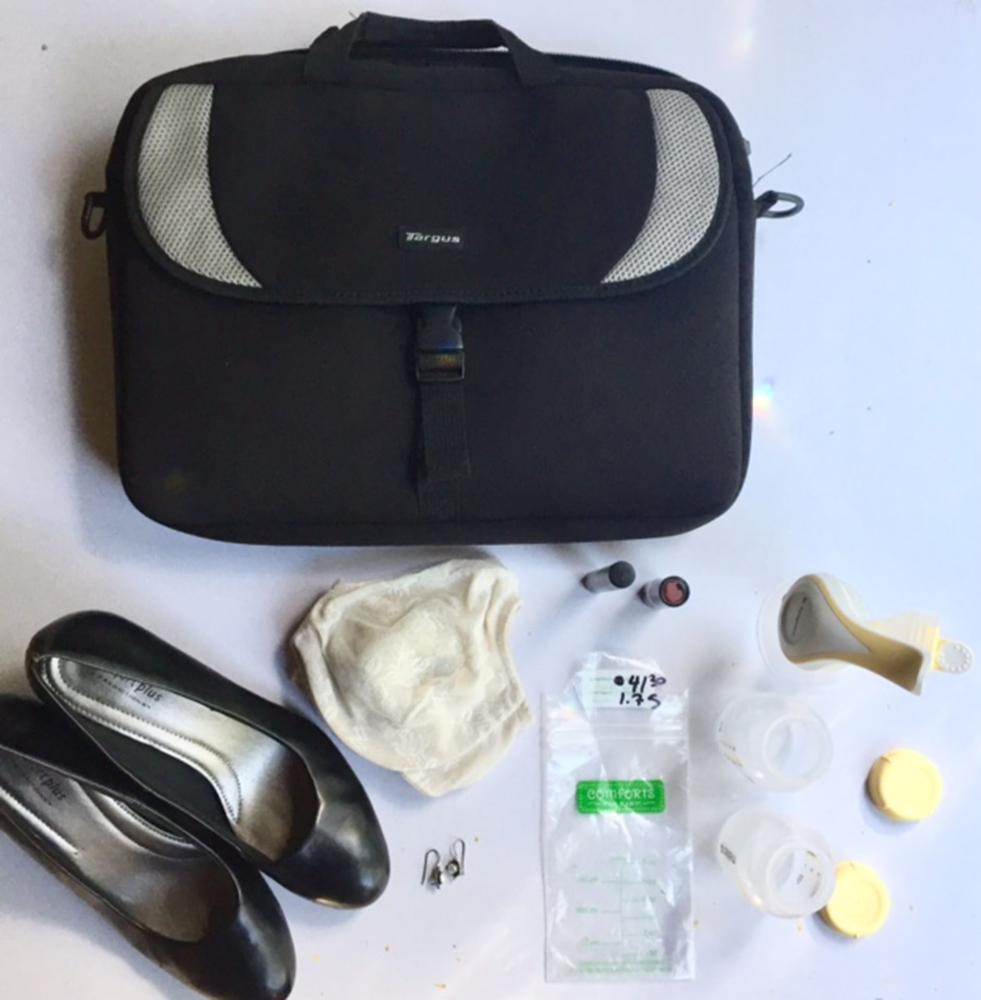

I created this series to bring awareness to the harsh realities of what it takes to be a working mother, especially when caring for an infant. Our system does not support new mothers or families during this transitional phase. It was my duty as a social artist to shed light on how taxing it is on our physical and mental health.

When you breastfeed, you are food on demand. You are up all night producing milk and feeding your baby. You wake up earlier than your shift starts to pump so that baby has enough food while you are gone. You go to work sleep deprived, not 100%, you work, you pump, you work, you pump. Then you come home and do it all over again. On top of how physically and mentally draining it is, you then have to fight for your rights in the workplace. When you ask for a clean and comfortable place to pump, you often get looks of annoyance and judgement. You are also expected to combine your breaks, lunch, and pump time all into the same fraction of time. You are not given adequate time, which can cause stress and anxiety to "perform" within the 15–30 minutes you've been allotted.

I started collecting the breastmilk bags initially not knowing how I was going to manifest a body of work from them. I just knew that I had to use them as a material in some way. In the wee hours of the morning as I would pump, sleep deprived, preparing to teach to over 100 students, I felt alone, as I think we often do. I didn't want to feel alone in this journey. I wanted to create something that would help to unite us as working mothers. We are not alone. My Working Mother Suit is a symbol of advocacy for all the working moms out there. While I only worked part-time, I pumped over 14 gallons of milk for my baby while I was away at work.

I wanted the series to visually resonate with the image I had for the traditional working mother: the business woman, in a navy dress suit, black heels, pearl earrings, and a briefcase. The suit is a work in progress and I am still adding bags, as I am still breastfeeding and working. Currently, I have attached 170 bags to the garment.

The meaning of this series is to honor the hard work that it takes to not only breastfeed your child but also to earn an income on top of that. Because mothers are often forced to work after having a child, they typically opt out of breastfeeding because it IS work. Breastfeeding is work and this laborious task is often diminished by those who have never experienced it. I hope that when people look at these images they realize how much we do as mothers. We are the pillars of society. We should be honored and supported more.

When I discovered that the United States is the only developed country in the world that does not offer paid maternity leave, I began to question our values as a society. How we treat mothers and women in our society reflects what we value the most and what we value the least. Mothers should be supported. Maternity laws need to change whether you choose to breastfeed or not, whether you choose to go back to work right away or not.
