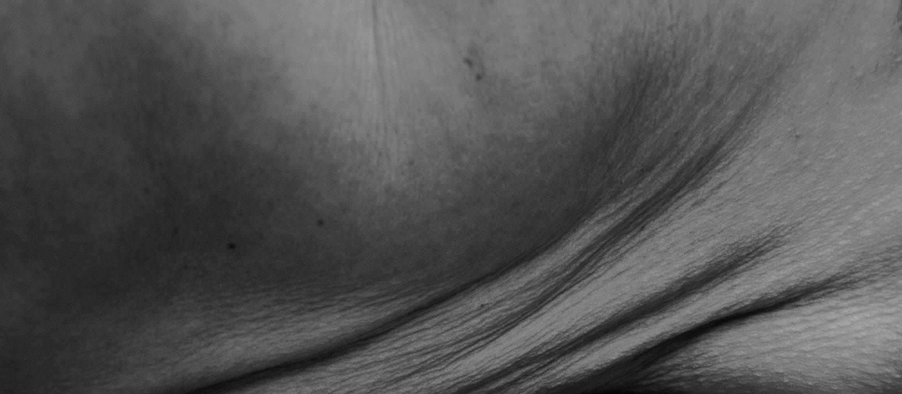
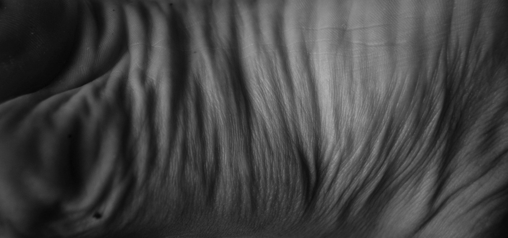
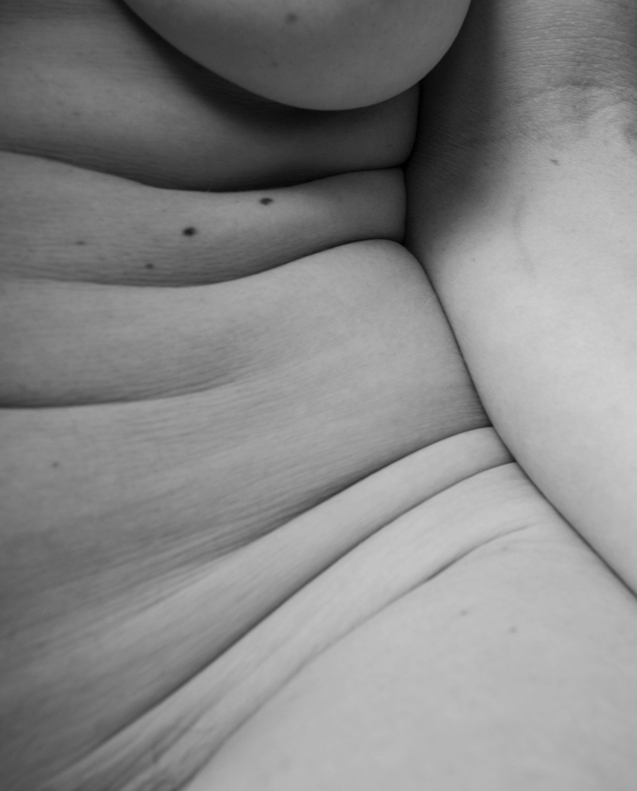
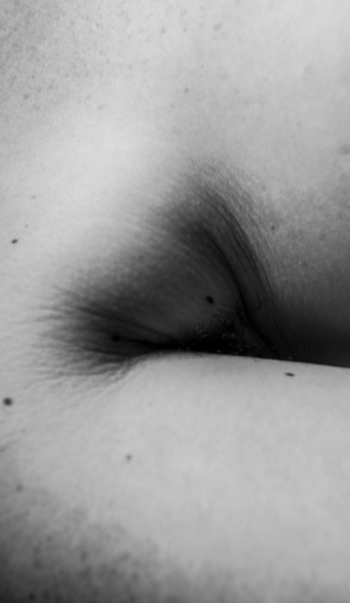
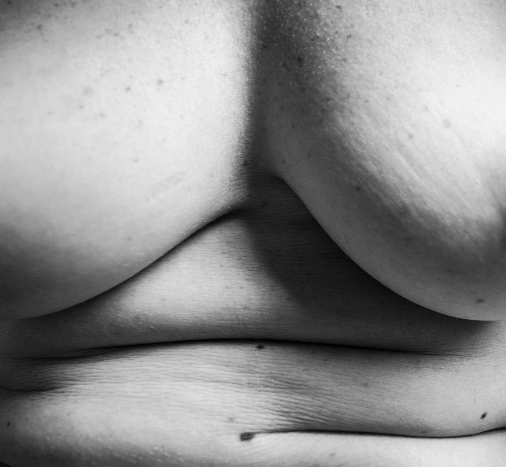
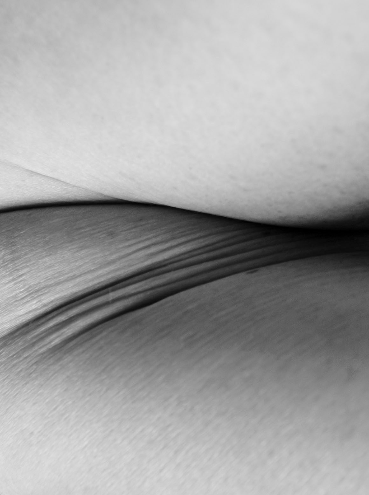

*Wrinkles and Curves: The Incessant Critique of Her Physique*

A series of black and white photographs that depict close up areas on my body that have been impacted as a result of motherhood and aging. Areas of myself that no matter how healthy I eat or how much I exercise, my subconscious always seems to obsess over. Will I ever be satisfied?

Through these photographs, I investigate why women undergo so much inner turmoil about the fleeting transformation of our bodies. Body image is a byproduct of our culture. No matter how beautiful a woman is, she will never feel fully satisfied with the way she looks. The way we critique our physique permeates into our psyche from a very young age. All girls and women are taught to compare themselves to other women and to hold high unreasonable standards for physical beauty. Every little wrinkle and curve is scrutinized to the point where it becomes the only thing she sees when she looks at herself in the mirror. We analyze every imperfect line on our bodies and hate the way it looks. It's a psychological battle between our strong empowered selves fending off the inundation of media images depicting the 'ideal' female form.

This series honors the aesthetic value found in the fleeting transformation of the female form. These photographs represent a celebration for my psychological break from the norm where I begin to redefine, reshape and reclaim my standards of beauty.

*Unexpected Places I*

*Unexpected Places II*

*Familiar Folds*

*Ripple Roll*

*Yielded Flesh*

*Weighted Hold*
