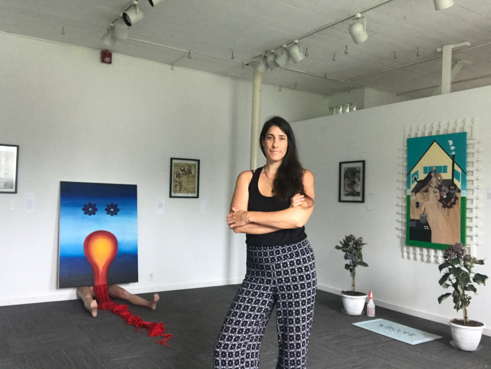

Kasey Jones is a multidisciplinary artist, designer, and educator based in Athens, Ohio. Her practice spans public art, murals, painting, sculpture, installation, photography, textiles, light, video, and sound. Working across disciplines and scales, Jones creates work characterized by bold color, high contrast, rhythm, pattern, and a strong sense of composition.

Jones holds an MFA in Community Arts from the Maryland Institute College of Art and a BFA in Art History from Ohio University. Her training in community arts continues to inform her approach to public work, where research, site, community engagement, and collaboration become part of the creative process. Her work often draws from nature, landscape, movement, identity, womanhood, motherhood, and contemporary social and environmental issues.

Her public art practice includes large-scale murals, immersive installations, and community-engaged projects created for organizations and communities across the United States. Whether working on an architectural scale or creating more intimate studio work, Jones is interested in art's ability to transform space, communicate ideas, and create meaningful connections between people and their environments.

In addition to her studio and public art practice, Jones is an educator, teaching art, design, and interdisciplinary creative practices at the college level.
